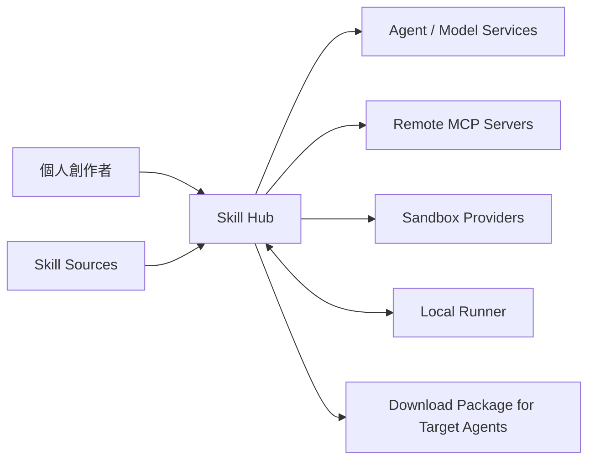

# ADR-000：系統情境與架構品質屬性

- 狀態：Accepted
- 日期：2026-08-13
- 決策者：產品負責人、架構規劃

## 背景

Skill Hub 讓個人創作者探索網路上的 Agent Skill，以自己的 Prompt、Dataset、MCP 或本機工具試跑，再依 Trace 與評估結果改善及下載 Skill。

系統會處理不受信任的內容、使用者資料、外部服務、模型呼叫與本機資源，因此不能只以一般內容網站的方式設計。架構必須同時支援產品驗證與未來企業級治理。

## 系統情境

### 主要使用者與外部系統

| 角色／系統 | 與 Skill Hub 的關係 |
| --- | --- |
| 個人創作者 | 搜尋、Fork、試跑、改善及下載 Skill |
| Skill 來源站 | 提供公開 Repository、套件或索引資料 |
| Agent／模型服務 | 執行 Agent 推理與模型評估 |
| 遠端 MCP Server | 提供試跑期間允許使用的工具 |
| Sandbox Provider | 提供隔離執行能力 |
| Local Runner | 在使用者裝置上存取指定本機工具與私有資料 |
| 目標 Agent | 安裝並使用 Skill Hub 匯出的 Skill |
| 身分、Secrets、儲存與 O11y 服務 | 提供平台基礎能力 |

## 決策

架構設計與評審依下列品質屬性排序：

1. **安全隔離**：不受信任程式碼、MCP、輸出與資料不能取得平台或其他使用者權限。
2. **可追溯與可重現**：每次 Run 可追溯 Skill Version、Test Case、Agent、模型、Provider、工具與環境。
3. **可抽換性**：Sandbox、Agent Runtime、模型與外部來源不得滲透核心領域模型。
4. **可靠與可恢復**：長時間 Run 在失敗、取消、逾時或服務重啟後可被安全處理。
5. **租戶隔離準備**：資料與權限自 MVP 起以 Workspace 為邊界。
6. **成本可計量**：模型、Sandbox、儲存、網路與 Artifact 成本能關聯至 Run 與 Workspace。
7. **可演進性**：MVP 避免不必要微服務，同時保留明確拆分接縫。
8. **可理解性**：非技術使用者能完成主要旅程，專業使用者可取得足夠技術證據。

## 架構適用範圍

### MVP 內

- Skill 匯入、驗證、索引、搜尋與 Fork。
- Test Case、Cloud Sandbox、Local Runner Beta、MCP 與 Trace。
- 評估、改善、重新試跑與打包下載。
- 個人 Workspace、基本用量與資料生命週期。

### 未來演進

- 團隊與企業 Workspace。
- 多區域執行平面與資料駐留。
- 多家 Sandbox Provider 與成本／政策路由。
- Marketplace、創作者收益及企業計費。

## 影響

### 正面

- 安全、可攜性與可觀察性成為架構的一級需求。
- 後續技術選型可以用一致品質屬性評估。
- MVP 與企業演進之間具備共同基線。

### 成本與限制

- 初期設計工作量高於單純在 Web Server 執行工作的做法。
- 需要較早處理識別、資料生命週期、短效權限與 Trace Schema。
- 部分使用體驗會因安全確認與隔離建立時間而增加步驟。

## 待決策

- 各品質屬性的量化 SLO 與容量假設。
- 首批執行區域與資料駐留需求。
- MVP 可接受的單次 Run 成本與啟動延遲。

