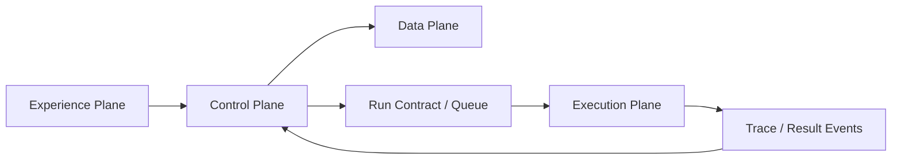

# ADR-001：採用模組化控制平面與隔離執行平面

- 狀態：Accepted
- 日期：2026-08-13
- 決策者：產品負責人、架構規劃

## 背景

Skill Hub 同時具有一般 SaaS 控制功能，以及執行外部 Skill、Script、MCP 與使用者資料的高風險功能。若兩者共用同一程序、主機權限或內部網路，任何不受信任工作負載都可能影響帳號、資料庫與其他使用者。

MVP 也需要快速迭代，不適合一開始拆成大量微服務。

## 評估選項

### 選項 A：單一 Web 應用直接執行 Run

- 優點：實作簡單、部署單純。
- 缺點：安全隔離不足、長時間工作影響 Web 請求、難以擴充多 Provider。

### 選項 B：全面微服務

- 優點：部署與權限邊界明確。
- 缺點：MVP 的運維、資料一致性與開發成本過高。

### 選項 C：模組化控制平面＋獨立執行平面

- 優點：控制邏輯保持集中，執行工作與核心資料分離；可按實際壓力拆分。
- 缺點：需要先定義非同步邊界、契約與失敗處理。

## 決策

採用選項 C：

- 控制平面初期以模組化單體及背景 Worker 為主。
- 執行平面使用獨立節點、網路區域與 Sandbox Provider。
- 不受信任工作負載不得在 Web/API 程序內執行。
- 執行平面不得直接查詢控制平面的關聯式資料庫。
- 控制平面透過任務契約、短效物件存取與事件接收和執行平面互動。

## 四個架構平面

| 平面 | 責任 | 不應負責 |
| --- | --- | --- |
| 體驗平面 | UI、API Edge、使用者互動與即時進度 | 直接執行 Script、保存明文 Secrets |
| 控制平面 | 身分、Skill、Run 決策、政策、評估與打包 | 執行不受信任工作負載 |
| 執行平面 | 建立隔離環境、執行、串流事件與清理 | 直接存取核心資料庫或長效平台憑證 |
| 資料平面 | 結構化資料、物件、搜尋、Secrets、事件與遙測 | 決定產品流程或替代領域規則 |

## 依賴方向

核心領域不得依賴特定 Sandbox SDK。Provider Adapter 依賴核心定義的 Port／Contract，而不是由核心領域依賴 Provider。

## 影響

### 正面

- 降低不受信任工作負載影響平台資料的風險。
- Web/API 與 Run 可分別擴展和部署。
- 未來能引入多種 Sandbox Provider 或區域執行平面。
- MVP 仍可維持少量部署單元。

### 成本與限制

- Run 必須採非同步體驗，不能假設單一同步 HTTP 請求完成。
- 需要處理重複訊息、延遲事件與部分失敗。
- 本機開發環境需能模擬控制平面與執行平面邊界。

## 驗證方式

- 架構測試確認 Web/API 不包含執行使用者 Script 的路徑。
- 網路政策確認 Sandbox 無法直接連核心資料庫與內部控制服務。
- 契約測試可用模擬 Provider 完成 Run 全生命週期。

