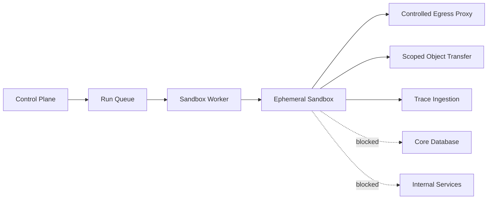

# ADR-005：MVP 初期採自建 Sandbox，並建立最低隔離基線

- 狀態：Accepted
- 日期：2026-08-13
- 決策者：產品負責人、架構規劃

## 背景

產品決定 MVP 初期可自行建立 Cloud Sandbox，同時保留未來切換不同 Sandbox 環境的能力。自建能掌握產品實驗、Trace 與執行流程，但也代表平台承擔不受信任程式碼的隔離責任。

普通容器並不自動等同安全 Sandbox，尤其當它與 Web 主機、資料庫或容器管理介面共用高權限資源時。

## 決策

建立 `SelfHostedProvider` 作為第一個 Cloud Sandbox Provider，但必須部署在獨立執行區域，遵循下列最低安全基線。隔離技術的具體產品選型另以後續 ADR 決定。

## 最低安全基線

### 計算隔離

- 每次 Run 使用獨立環境與暫存工作區。
- 工作負載使用非 root、非特權身分。
- 不允許 privileged mode、Host PID／IPC／Network namespace。
- 不掛載 Docker、Container Runtime 或管理 Socket。
- 基礎檔案系統唯讀；只開放明確的暫存及輸出路徑。
- 套用系統呼叫、Linux capabilities 或同等機制的最小權限限制。
- 限制 CPU、記憶體、磁碟、程序數、檔案描述符與最大執行時間。

### 網路隔離

- 預設拒絕所有非必要出站網路。
- 允許的模型、MCP 與外部服務經受控 Egress Proxy。
- 阻擋 Loopback、Link-local、Metadata Service、RFC1918／內部網路及控制平面位址，除非特定受管整合明確允許。
- 記錄目的地、協定、決策與資料量，不記錄 Secrets 明文。
- Sandbox 不接受網際網路主動入站連線。

### 資料與憑證

- Skill、Dataset 與設定透過單次 Run 的短效授權取得。
- Sandbox 不取得平台長效憑證或資料庫權限。
- Secrets 只在必要時間和程序可見，避免寫入磁碟與 Log。
- Artifact 上傳使用限定目的地、大小與有效期的權限。
- Run 結束後銷毀暫存空間；失敗或逾時也必須清理。

### 執行映像

- MVP 只允許預先建置、版本化與掃描的 Runtime Image。
- 不允許使用者直接指定任意基礎 Image。
- Image 需保存內容摘要、SBOM 或依賴清單、建置來源及漏洞掃描結果。
- Image 更新不得改變歷史 Run 記錄中的 Runtime Version。

## 執行節點拓撲

執行節點與 Web/API、資料庫及控制平面服務至少使用網路與身分政策隔離。生產環境不得把未受信任工作負載排到一般應用節點。

## 清理與遺留資源

- `destroy` 可重複呼叫。
- Run 終止後記錄 `cleanup_status`，不以最終回應成功取代清理確認。
- 定期 Reconciler 掃描超過期限的 Sandbox、Volume、Network Rule 與短效憑證。
- 遺留資源超過門檻時告警，必要時暫停新 Run。

## MVP 限制

- 限定少量 Runtime、檔案格式與最大資源。
- 預設禁止一般網際網路存取。
- 遠端 MCP 僅接受受支援的安全傳輸及政策允許目的地。
- 不支援 GPU、特權程序、巢狀容器或長時間背景服務。

## 影響

### 正面

- 能掌握 MVP 的 Trace、政策與產品體驗。
- Provider-neutral 邊界仍允許未來遷移或混合使用第三方服務。
- 安全基線明確阻止把一般容器誤當完整隔離方案。

### 成本與限制

- 平台承擔 Sandbox 逃逸、資源濫用與網路外洩風險。
- 需要專門的安全測試、修補、映像供應鏈與 24/7 告警能力。
- Runtime 支援範圍必須刻意限制。

## 待決策

- Container、強化 Container、MicroVM 或其他隔離技術。→ [ADR-015](./ADR-015-sandbox-isolation-technology.md)（gVisor 基線）
- 執行節點的雲端、區域與容量模式。→ [ADR-015](./ADR-015-sandbox-isolation-technology.md) 待決策，隨部署平台確認；平台由 [ADR-018](./ADR-018-containerized-core-infrastructure.md) 選定（Hetzner Cloud），節點編排形式與租戶模型見 [ADR-022](./ADR-022-sandbox-deployment-topology-and-security-thresholds.md) Q1、Q2
- Egress Proxy、DNS Policy 與 Artifact 掃描的具體實作。→ Egress 原則見 [ADR-015](./ADR-015-sandbox-isolation-technology.md)；**Egress 與 DNS 的具體實作、允許清單管理流程與目的地記錄見 [ADR-022](./ADR-022-sandbox-deployment-topology-and-security-thresholds.md) Q3**（2026-08-16）。**Artifact 掃描仍待定**（威脅模型 Q8，ADR-007 待決策）
- 本節「清理與遺留資源」的門檻值（Reconciler 掃描頻率、遺留資源告警與暫停門檻）與「執行映像」的掃描有效期、漏洞等級門檻。→ [ADR-022](./ADR-022-sandbox-deployment-topology-and-security-thresholds.md) 第二部分（2026-08-16 定值）

