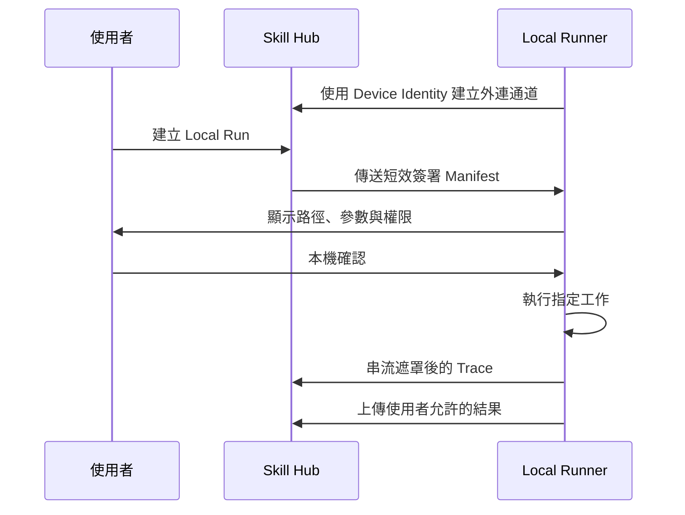

# ADR-006：以 Local Runner 存取本機工具絕對路徑與私有資料

- 狀態：Accepted
- 日期：2026-08-13
- 決策者：產品負責人、架構規劃

## 背景

使用者希望提供本機工具的絕對路徑，例如 `C:\tools\analyze.exe`。Cloud Sandbox 位於遠端，不可能直接存取使用者電腦的路徑；若將工具與所有資料上傳，又可能違反隱私、授權或檔案大小限制。

## 決策

本機絕對路徑與選定私有資料由 Local Runner Provider 處理。Local Runner 安裝在使用者裝置，主動建立對 Skill Hub 的安全外連通道，並在裝置端再次取得使用者確認。

Cloud UI 不得把本機路徑描述成 Cloud Sandbox 可直接存取的資源。

時程註記：本架構決策成立，但 Local Runner 實作移出 MVP 首發，依 M2 後的需求訊號啟動；MVP 期間唯一生效的規則是上述「不得誤導可存取本機路徑」。

## 信任模型

- Runner 具有獨立 Device Identity，不共用一般瀏覽器 Session Token。
- 配對需要短效一次性碼或等效安全流程。
- 配對可由使用者撤銷，失竊裝置可被停用。
- 每次工作使用短效、限單次 Run 的簽署 Manifest。
- 本機確認是獨立安全步驟，不能只由雲端 UI 的舊確認取代。

## Run Manifest

至少包含：

- 平台 Run ID、Attempt ID、到期時間與防重放識別。
- Skill Version 與內容摘要。
- 允許的工具絕對路徑。
- 參數、工作目錄與環境變數名稱。
- 允許讀寫的路徑範圍。
- 網路、執行時間與資源政策。
- 可回傳的 Trace 與 Artifact 類型。

Runner 驗證 Manifest 簽章、到期時間與裝置目標後才顯示確認。

## 使用者確認

Runner 在本機顯示：

- 實際執行檔與解析後路徑。
- 完整參數與工作目錄。
- 預計讀取、寫入或上傳的資料範圍。
- 遠端 MCP、網路目的地與 Secrets 使用情況。
- 取消方式與 Run 期限。

Manifest 或權限變更後必須重新確認。

## 通訊模式

不要求使用者開放入站 Port，也不以雲端直接控制任意 Shell 為目標。

## 本機安全邊界

- 首版只執行明確選定的工具，不提供通用遠端終端機。
- 路徑在確認與執行時重新解析，防範符號連結、捷徑或路徑置換。
- 參數以結構化陣列傳遞，不以未經處理的 Shell 字串串接。
- Runner 自身以最低可行權限執行。
- 未授權檔案不被讀取或上傳。
- Secrets、Token 與敏感輸出在送往雲端前遮罩；高度敏感模式可只回傳摘要。
- 使用者可在本機立即取消，Runner 回報取消與清理結果。

## 離線與失聯

- Runner 失聯時 Run 進入可辨識狀態，不自動轉至 Cloud Sandbox。
- 到期 Manifest 不得在重新連線後執行。
- 執行中失聯時，Runner 依本機政策在期限內取消並清理。
- 本機暫存 Trace 在成功傳輸或到期後清除。

## 影響

### 正面

- 使用者可保留私有資料和工具在本機。
- 解決 Cloud Sandbox 無法存取本機絕對路徑的根本限制。
- Local Runner 可作為標準 Provider 接入共同 Run 與 Trace 模型。

### 成本與限制

- 需要跨平台安裝、更新、簽章與裝置安全能力。
- 本機環境差異降低結果可重現性。
- Runner 若設計不慎可能取得過大權限，因此 MVP 必須限制能力。

## 待決策

- 首批支援的作業系統與更新機制。
- Runner 是否內建額外程序隔離。
- 高度敏感資料模式下允許回傳的 Trace 細節。

