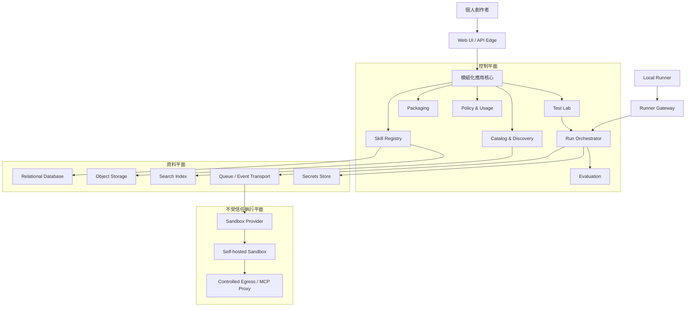

# Skill Hub 架構決策紀錄

- 日期：2026-08-13
- 範圍：Skill Hub MVP 與企業級演進基線
- 對應產品規劃：[MVP 規劃](../plans/mvp/README.md)

## 目的

本目錄保存 Skill Hub 的架構決策紀錄（Architecture Decision Records, ADR）。每份 ADR 聚焦一項可獨立評審的決策，說明背景、選項、決策、影響與後續工作。

ADR 是決策歷史，不是只描述最終系統狀態。若未來推翻既有決策，應新增 ADR 並將舊文件標記為 `Superseded`，而不是直接刪除舊紀錄。

## 狀態定義

| 狀態 | 意義 |
| --- | --- |
| Proposed | 已提出，等待架構或產品評審 |
| Accepted | 已同意採用，後續實作應遵循 |
| Rejected | 已評估但不採用 |
| Deprecated | 仍存在但不建議繼續使用 |
| Superseded | 已由新的 ADR 取代 |

## 決策索引

| ADR | 主題 | 狀態 |
| --- | --- | --- |
| [ADR-000](./ADR-000-system-context-and-quality-attributes.md) | 系統情境與架構品質屬性 | Accepted |
| [ADR-001](./ADR-001-modular-control-plane-and-isolated-execution-plane.md) | 模組化控制平面與隔離執行平面 | Accepted |
| [ADR-002](./ADR-002-domain-boundaries-and-ownership.md) | 領域邊界與模組責任 | Accepted |
| [ADR-003](./ADR-003-data-ownership-and-storage.md) | 資料所有權、儲存與生命週期 | Accepted |
| [ADR-004](./ADR-004-provider-neutral-run-orchestration.md) | Provider-neutral Run Orchestration | Accepted |
| [ADR-005](./ADR-005-self-hosted-sandbox-baseline.md) | 初期自建 Sandbox 與隔離基線 | Accepted |
| [ADR-006](./ADR-006-local-runner-for-local-resources.md) | Local Runner 與本機資源存取 | Accepted |
| [ADR-007](./ADR-007-trust-security-and-supply-chain.md) | 信任、安全區域與 Skill 供應鏈 | Accepted |
| [ADR-008](./ADR-008-asynchronous-workflows-and-domain-events.md) | 非同步工作流程與領域事件 | Accepted |
| [ADR-009](./ADR-009-observability-trace-and-evaluation-boundaries.md) | 平台 O11y、Run Trace 與評估邊界 | Accepted |
| [ADR-010](./ADR-010-mvp-deployment-and-evolution-path.md) | MVP 部署形態與服務拆分路徑 | Accepted |
| [ADR-011](./ADR-011-workspace-tenancy-policy-and-usage.md) | Workspace、多租戶準備、政策與用量 | Accepted |
| [ADR-012](./ADR-012-packaging-portability-and-agent-adapters.md) | 打包、可攜性與 Agent Adapter | Accepted |
| [ADR-013](./ADR-013-intent-search-architecture.md) | 意圖搜尋混合檢索與 LLM 增強 | Accepted |
| [ADR-014](./ADR-014-core-infrastructure-selection.md) | 核心基礎設施最小受管組合 | Superseded（由 [ADR-018](./ADR-018-containerized-core-infrastructure.md)） |
| [ADR-015](./ADR-015-sandbox-isolation-technology.md) | Sandbox 隔離技術（gVisor 基線） | Accepted |
| [ADR-016](./ADR-016-language-and-framework-selection.md) | 語言與框架（TS／Go／Python） | Accepted |
| [ADR-017](./ADR-017-model-gateway-and-llm-observability.md) | 模型閘道與 LLM 可觀測性（LiteLLM＋Langfuse） | Accepted |
| [ADR-018](./ADR-018-containerized-core-infrastructure.md) | 核心基礎設施容器化自架（E1 起步，取代 ADR-014） | Accepted |
| [ADR-019](./ADR-019-monorepo-structure-and-cicd.md) | Monorepo 目錄結構與 CI/CD | Proposed |
| [ADR-020](./ADR-020-authentication-and-session-model.md) | 身分驗證與 Session(GitHub OAuth＋Postgres Session) | Proposed |
| [ADR-021](./ADR-021-skill-license-provenance.md) | Skill License 溯源與多層 Provenance | Accepted |
| [ADR-022](./ADR-022-sandbox-deployment-topology-and-security-thresholds.md) | Sandbox 部署拓撲與安全驗收定值（含 Container registry 採 GHCR） | Accepted |
| [ADR-023](./ADR-023-agent-sdk-version-pinning-and-behaviour-revalidation.md) | Agent SDK 版本釘選與行為重驗政策（靜默失效不得以推理帶過） | Accepted |
| [ADR-024](./ADR-024-top-level-repository-layout.md) | 頂層目錄分「跑的」與「讀的」（文件收進 `docs/`，修訂 ADR-019 §1） | Accepted |

## 整體架構摘要

## 核心架構原則

1. 不受信任的 Skill、Script、資料與工具輸出不可在主要 Web/API 程序內執行。
2. 控制平面負責決策與治理；執行平面只取得一次 Run 所需的最小短效權限。
3. Skill Version、Test Case 與 Run 輸入皆以不可變快照確保可重現性。
4. Provider、模型、Agent Runtime、搜尋來源與儲存實作均透過明確邊界抽換。
5. 平台永久 ID 與外部 Provider 臨時 ID 分離。
6. 使用者可見 Run Trace 與平台基礎設施 Observability 分開管理。
7. MVP 採可演進的模組化架構；只在負載、組織或安全需求成立時拆服務。
8. 每筆使用者資料從第一天就具備 Workspace 邊界，即使 MVP 只有個人工作區。

## 評審與維護方式

- 每份 `Proposed` ADR 應在實作對應工作前完成評審。
- ADR 的重大待決策事項應同步回寫至 [MVP 工作項目](../plans/mvp/03-work-items.md)。
- 實作與 ADR 不一致時，應先確認是實作偏離，還是架構決策需要更新。
- 技術選型應另外新增 ADR；本批文件優先定義穩定的架構邊界，而非提前鎖定產品或雲端供應商。

