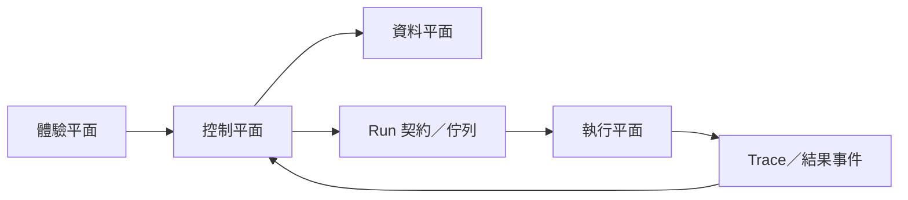

# ADR-001：系統情境、平面與部署路徑

- 狀態：Accepted
- 相關：[ADR-002 資料所有權與核心基礎設施](./ADR-002-data-ownership-and-core-infrastructure.md)、[ADR-003 Run 編排與非同步工作流程](./ADR-003-run-orchestration-and-async-workflows.md)、[ADR-004 Sandbox 隔離與執行安全](./ADR-004-sandbox-isolation-and-execution-security.md)、[ADR-005 模型閘道與可觀測性](./ADR-005-model-gateway-and-observability.md)、[ADR-012 互動創作](./ADR-012-interactive-creation.md)、[ADR-016 Platform Bounded Context 與 Context Map](./ADR-016-platform-bounded-contexts-and-context-map.md)

## 背景

Skill Hub 讓創作者搜尋、試跑、改善及下載 Agent Skill，過程中必須處理不受信任的 Skill、Script、資料、外部模型呼叫與本機資源存取。系統不能以一般內容網站的方式設計：任何不受信任工作負載都可能危及帳號、核心資料與其他使用者，而產品同時要在單人／小團隊的開發速度下，於 MVP 階段驗證核心價值，並保留企業級治理與多區域執行的演進空間。

這份決策要回答：系統的外部情境與適用範圍是什麼、架構要以哪些品質屬性排序、控制邏輯與不受信任執行如何分離、每個平面用什麼語言與框架、MVP 用多少部署單元起步以及依什麼訊號拆分、如何讓使用者在不上傳全部本機資料與工具的情況下試跑本機資源。

## 決策

### 決策 1：系統情境與範圍

Skill Hub 與下列外部角色／系統互動：

| 角色／系統 | 與 Skill Hub 的關係 |
| --- | --- |
| 個人創作者 | 搜尋、Fork、試跑、改善及下載 Skill |
| Skill 來源站 | 提供公開 Repository、套件或索引資料 |
| Agent／模型服務 | 執行 Agent 推理與模型評估 |
| 遠端 MCP Server | 提供試跑期間允許使用的工具 |
| Sandbox Provider | 提供隔離執行能力 |
| Local Runner | 在使用者裝置上存取指定本機工具與私有資料 |
| 目標 Agent | 安裝並使用 Skill Hub 匯出的 Skill |
| 身分、Secrets、儲存與 O11y 服務 | 提供平台基礎能力 |

MVP 範圍涵蓋 Skill 匯入、驗證、索引、搜尋與 Fork；Test Case、Cloud Sandbox、MCP 與 Trace；評估、改善、重新試跑與打包下載；個人 Workspace、基本用量與資料生命週期。團隊／企業 Workspace、多區域執行與資料駐留、多家 Sandbox Provider 與成本／政策路由、Marketplace／創作者收益及企業計費屬於未來演進，不在目前架構承諾範圍內。

### 決策 2：架構品質屬性優先序

架構設計與評審依下列順序排序（前者與後者衝突時，前者優先）：

1. **安全隔離**：不受信任程式碼、MCP、輸出與資料不能取得平台或其他使用者權限。
2. **可追溯與可重現**：每次 Run 可追溯 Skill Version、Test Case、Agent、模型、Provider、工具與環境。
3. **可抽換性**：Sandbox、Agent Runtime、模型與外部來源不得滲透核心領域模型。
4. **可靠與可恢復**：長時間 Run 在失敗、取消、逾時或服務重啟後可被安全處理。
5. **租戶隔離準備**：資料與權限自 MVP 起以 Workspace 為邊界。
6. **成本可計量**：模型、Sandbox、儲存、網路與 Artifact 成本能關聯至 Run 與 Workspace。
7. **可演進性**：MVP 避免不必要微服務，同時保留明確拆分接縫。
8. **可理解性**：非技術使用者能完成主要旅程，專業使用者可取得足夠技術證據。

### 決策 3：四個架構平面與依賴方向

系統劃分為四個平面，依賴只能單向流動：

| 平面 | 責任 | 不應負責 |
| --- | --- | --- |
| 體驗平面 | UI、API Edge、使用者互動與即時進度 | 直接執行 Script、保存明文 Secrets |
| 控制平面 | 身分、Skill、Run 決策、政策、評估與打包 | 執行不受信任工作負載 |
| 執行平面 | 建立隔離環境、執行、串流事件與清理 | 直接存取核心資料庫或長效平台憑證 |
| 資料平面 | 結構化資料、物件、搜尋、Secrets、事件與遙測 | 決定產品流程或替代領域規則 |

不受信任工作負載不得在 Web／API 程序內執行；執行平面不得直接查詢控制平面的關聯式資料庫，只透過任務契約、短效物件存取與事件與控制平面互動。核心領域不得依賴特定 Sandbox SDK：Provider Adapter 依賴核心定義的 Port／Contract，而不是核心領域依賴 Provider；這條依賴方向適用於所有外部系統，通則見 [ADR-024](./ADR-024-ports-and-adapters-for-external-systems.md)。對應到目前實際跑的四個行程：`apps/web`（體驗平面）只對 `apps/platform` 的 API 說話，契約在 `contracts/openapi/public.yaml`；`apps/platform`（控制平面，含 API 行程與 Go Worker）是唯一控制平面，狀態全在同一個 PostgreSQL；Go Worker 是唯一的佇列消費者，以內部 HTTP 呼叫 `apps/llm`（能力提供者）與 `apps/sandbox`（執行平面，Sandbox Provider）；執行平面永遠碰不到核心資料庫。

**驗證方式**：架構測試確認 Web/API 不包含執行使用者 Script 的路徑；網路政策確認 Sandbox 無法直接連核心資料庫與內部控制服務；契約測試可用模擬 Provider 完成 Run 全生命週期。

### 決策 4：控制平面採領域導向模組化單體

控制平面採領域導向的模組化單體：每個領域模組擁有自己的領域規則、應用服務與資料存取邊界，涵蓋身分與工作區、Skill 探索、Skill 資產與版本、信任與供應鏈、試跑情境設計、Run 編排、評估與改善、打包與散布、執行證據、政策與用量、產品分析等能力；其他模組只能透過公開 API、領域事件或唯讀投影互動，不得直接存取彼此的資料表。跨模組規則：

- 每個模組的寫入只能由該模組自己執行。
- 跨模組同步查詢只用於短、可靠且無循環依賴的情境；長時間流程以 Application Workflow／Process Manager 協調。
- 搜尋、Dashboard 與比較畫面可使用去正規化讀取模型，不必直接 Join 所有領域表。
- 模組間傳遞 ID、版本與必要事實，不傳遞可被任意修改的共享 Entity。

模組的完整清單、資料所有權對照表與程式路徑由 [ADR-016](./ADR-016-platform-bounded-contexts-and-context-map.md) 擁有並由 CI 對帳；本決策只定義組織原則，不重複其表格。

### 決策 5：語言與框架依平面分工

| 平面 | 語言 | 範圍 |
| --- | --- | --- |
| 體驗平面 | TypeScript（React） | Web UI、進度串流、Trace 檢視 |
| 控制＋執行平面 | Go | API、領域模組、Run 狀態機、佇列 Worker、Sandbox Worker |
| LLM 工作負載 | Python | 索引時增強、查詢改寫、LLM Judge、改善建議與生成 |

框架與函式庫選擇：

| 層 | 選擇 |
| --- | --- |
| 前端 | Vite + React + TanStack Router/Query |
| Go HTTP | 標準庫優先的薄層路由器（chi／echo） |
| Go 資料存取 | pgx + sqlc（SQL-first） |
| Go 佇列 | River（Postgres 佇列，與 Outbox 同庫同交易） |
| 模組邊界檢查 | Go internal package + 依賴 lint（go-arch-lint 類），機制細節見 [Platform Bounded Context 與 Context Map](./ADR-016-platform-bounded-contexts-and-context-map.md) |
| Python 服務 | FastAPI，uv 管理，模型呼叫以 openai 套件建構的 client 指向模型閘道 |
| 契約 | OpenAPI-first，Go 為 spec 來源，codegen 產生 TS client 與 Python server／client stub |

`apps/llm` 目前每個端點各自對模型閘道發出一次呼叫，不包任何迴圈；服務的直接依賴只有 FastAPI、Uvicorn、官方模型 SDK 與 Pydantic。多步驟編排（例如互動創作）屬獨立設計，見 [ADR-012](./ADR-012-interactive-creation.md)，未實作前不得假設 `apps/llm` 內有跨請求的持久化工作流狀態。Sandbox 內供 Skill 執行的 Agent Runtime 語言由 Runtime Image 決定，與此處的平台語言選型無關。

### 決策 6：跨語言邊界守則

1. **狀態單一擁有者**：Run 與工作流的持久化狀態只存在於 Go 擁有的 Postgres 狀態機。Python 服務內任何程序內或跨請求的狀態都只是暫存草稿，不得成為第二個持久化工作流層。
2. **能力提供者不擁有規則**：Python 服務接受結構化請求、回傳結構化結果（含證據與信心）；政策、授權、狀態轉移與重試決策全在 Go，業務規則不寫入 Python。
3. **佇列消費者只有 Go Worker**：Python 不消費佇列；Go Worker 以內部 HTTP 呼叫 Python（含逾時與取消傳遞），排程、重試與冪等由 Go 管理。
4. **契約先行**：跨語言介面先寫 OpenAPI schema 再實作，CI 以 codegen 檢查 drift。

### 決策 7：MVP 部署單元與環境

MVP 建議部署單元：Web UI、Control Plane API（模組化單體）、Background Worker（匯入、索引、評估、打包與刪除）、Run Orchestrator Worker、Self-hosted Sandbox Worker／Execution Node、關聯式資料庫、物件儲存、Queue／Event Transport、搜尋能力、Secrets Store、Observability Stack、Python LLM 服務、模型閘道。部署單元不等同領域模組：多個模組可共存於同一程序，但依賴與資料所有權仍受決策 4 約束。Local Runner Client 不在 MVP 首發範圍，依決策 10 的邊界獨立啟動。

四個環境：

- **Local Development**：可用 Fake Provider 或受限本機 Sandbox，不得降低生產安全假設。
- **Integration**：驗證資料庫、物件、Queue、Provider Contract 與外部整合。
- **Staging**：與生產相同安全區域及政策，使用非生產 Secrets 和資料。
- **Production**：控制與執行區隔離，具備用量限制、告警及緊急停用能力。

### 決策 8：可用性、擴展與服務拆分觸發條件

Web／API 以無狀態方式水平擴展，狀態保存於受管資料層；Worker 依 Queue 深度與工作類型分別擴展；Sandbox Worker 依 Runtime、區域、安全等級與容量池分組；搜尋投影可重建，不作核心交易單點；Provider 不可用時以清楚狀態阻擋或依政策路由，不靜默改變環境。

服務拆分必須由明確壓力觸發，而非為了預測未來；拆分前需確認獨立擴展、獨立部署、安全邊界、資料所有權或團隊責任至少一項有實際需求：

| 壓力 | 優先拆分候選 |
| --- | --- |
| Run 數量、部署頻率或安全責任獨立 | Run Orchestrator |
| 外部 Skill 數量與匯入負載增長 | Ingestion／Trust Worker |
| 搜尋規模與查詢演進速度增長 | Catalog & Search |
| 模型評估成本與併發增長 | Evaluation Worker／Service |
| 多區域與資料駐留 | Regional Execution Plane |
| 企業政策、稽核與計費複雜 | Policy、Usage、Billing |
| 多 Provider 路由與採購治理 | Provider Router |

### 決策 9：災難復原與備份基線

關聯式資料庫與物件儲存需有獨立備份／版本政策；搜尋索引及部分讀取投影可由事實來源重建，不需獨立備份；Queue 不是永久事實來源，工作流狀態需持久化在資料庫；Provider 執行環境為暫時性，不納入備份；Secrets 需要獨立備份、輪替與撤銷程序。

### 決策 10：Local Runner 作為本機資源的獨立 Provider

使用者可提供本機工具絕對路徑與私有資料；Cloud Sandbox 位於遠端，不可能直接存取使用者電腦路徑，也不應要求使用者把工具與全部資料上傳。本機絕對路徑與選定私有資料由 Local Runner Provider 處理：Local Runner 安裝在使用者裝置，主動建立對 Skill Hub 的安全外連通道，並在裝置端再次取得使用者確認。Cloud UI 不得把本機路徑描述成 Cloud Sandbox 可直接存取的資源。此架構決策成立，但 Local Runner 實作不在 MVP 首發範圍，依後續需求訊號啟動；MVP 期間唯一生效的規則是上一句「不得誤導可存取本機路徑」。

**信任模型**：Runner 具有獨立 Device Identity，不共用一般瀏覽器 Session Token；配對需要短效一次性碼或等效安全流程，可由使用者撤銷，失竊裝置可被停用；每次工作使用短效、限單次 Run 的簽署 Manifest；本機確認是獨立安全步驟，不能只由雲端 UI 的舊確認取代。

**Run Manifest** 至少包含：平台 Run ID、Attempt ID、到期時間與防重放識別；Skill Version 與內容摘要；允許的工具絕對路徑；參數、工作目錄與環境變數名稱；允許讀寫的路徑範圍；網路、執行時間與資源政策；可回傳的 Trace 與 Artifact 類型。Runner 驗證 Manifest 簽章、到期時間與裝置目標後才顯示確認。

**使用者確認**：Runner 在本機顯示實際執行檔與解析後路徑、完整參數與工作目錄、預計讀取／寫入／上傳的資料範圍、遠端 MCP／網路目的地與 Secrets 使用情況、取消方式與 Run 期限；Manifest 或權限變更後必須重新確認。

**通訊模式**：Runner 以 Device Identity 建立外連通道；使用者於 Skill Hub 建立 Local Run 後，平台傳送短效簽署 Manifest 給 Runner；Runner 顯示路徑、參數與權限並取得本機確認後執行工作，串流遮罩後的 Trace 並上傳使用者允許的結果。不要求使用者開放入站 Port，也不以雲端直接控制任意 Shell 為目標。

**本機安全邊界**：首版只執行明確選定的工具，不提供通用遠端終端機；路徑在確認與執行時重新解析，防範符號連結、捷徑或路徑置換；參數以結構化陣列傳遞，不以未經處理的 Shell 字串串接；Runner 自身以最低可行權限執行；未授權檔案不被讀取或上傳；Secrets、Token 與敏感輸出在送往雲端前遮罩，高度敏感模式可只回傳摘要；使用者可在本機立即取消，Runner 回報取消與清理結果。

**離線與失聯**：Runner 失聯時 Run 進入可辨識狀態，不自動轉至 Cloud Sandbox；到期 Manifest 不得在重新連線後執行；執行中失聯時，Runner 依本機政策在期限內取消並清理；本機暫存 Trace 在成功傳輸或到期後清除。

## 影響

### 正面

- 安全、可攜性與可觀察性成為架構的一級需求，後續技術選型可用一致品質屬性評估。
- 降低不受信任工作負載影響平台資料的風險；Web/API 與 Run 可分別擴展和部署。
- 每種語言用在生態最強處：Go 掌控狀態機與執行平面，Python 集中 LLM 邏輯，TypeScript 承擔真正有 UI 複雜度的體驗層。
- 未來可引入多種 Sandbox Provider 或區域執行平面，控制 MVP 複雜度的同時保留明確拆分接縫。
- 使用者可保留私有資料和工具在本機；Local Runner 可作為標準 Provider 接入共同 Run 與 Trace 模型。

### 成本與限制

- 初期設計工作量高於單純在 Web Server 執行工作的做法，需較早處理識別、資料生命週期、短效權限與 Trace Schema；部分使用體驗會因安全確認與隔離建立時間而增加步驟。
- Run 必須採非同步體驗，需處理重複訊息、延遲事件與部分失敗；Python 服務身處 Run 關鍵路徑，需納入 O11y 與逾時預算；本機開發環境需能模擬控制平面與執行平面邊界，並同時啟動三個 runtime。
- 三套工具鏈、測試與 CI 管線；契約 drift 是主要風險，靠 OpenAPI codegen 與契約測試壓制。
- 模組化單體需要自動化依賴規則，否則容易退化成大泥球；Background Worker 初期共用部署時，需避免單一工作類型耗盡全部資源；部分企業能力要等實際需求後才完整設計。
- Local Runner 需要跨平台安裝、更新、簽章與裝置安全能力；本機環境差異降低結果可重現性；若設計不慎可能取得過大權限，因此首版必須限制能力範圍。

## 待決策

- 各品質屬性的量化 SLO，以及 RPO、RTO 與緊急變更流程。
- 容量假設與容量估算；MVP 可接受的**啟動延遲**。**單次 Run 成本不在此列**——上限已定值並在派送前強制，跌破負債下限即拒絕。
- Go↔Python 內部通訊維持 REST 或改 gRPC，待流量與串流需求確認。
- 公開 Skill 頁面的 SEO 需求與 SSR 時點。
- Local Runner 首批支援的作業系統與更新機制；是否需要內建額外程序隔離；高度敏感資料模式下允許回傳的 Trace 細節。**這三項是刻意延後而不是懸而未決**：Local Runner 已移出 MVP 首發，依需求訊號啟動時再決。
