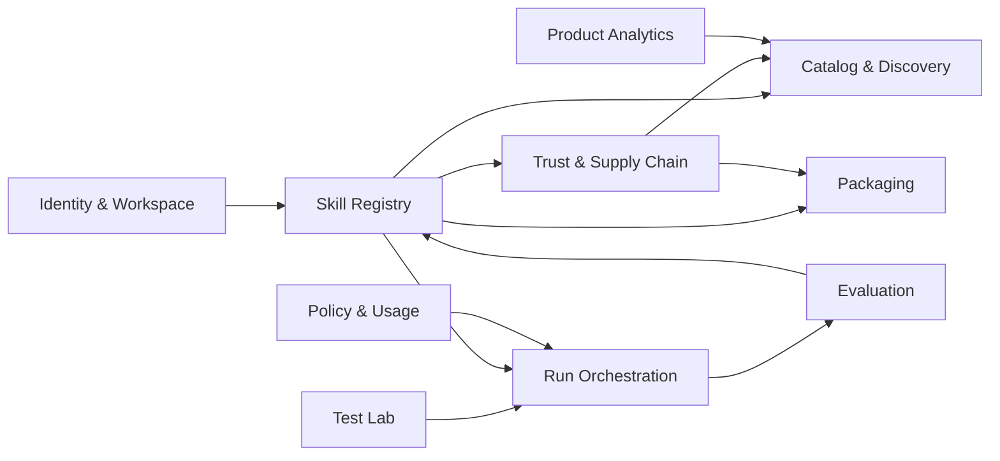

# ADR-002：定義控制平面的領域邊界與所有權

- 狀態：Accepted
- 日期：2026-08-13
- 決策者：產品負責人、架構規劃
- 修訂：package 對應與 Product Analytics 邊界見 [ADR-037](./ADR-037-product-analytics-and-package-architecture-identities.md)

## 背景

Skill Hub 涵蓋搜尋、版本、信任、試跑、評估及打包等不同業務能力。如果所有資料與邏輯集中在共用 Service 或以資料表為中心組織，後續會產生跨模組耦合，也難以判斷哪些能力適合拆分。

## 決策

控制平面採領域導向的模組化單體。每個模組擁有自己的領域規則、應用服務與資料存取邊界；其他模組透過公開 API、領域事件或只讀投影互動。

## 2026-08-22 產品領域名稱釐清（ADR-038 Accepted）

本 ADR 已接受的模組所有權與下節名稱保持不變；它們也是程式治理使用的 stable Boundary ID。為避免把 Go package 或 `Core`／`Supporting` 誤當成產品語言，[ADR-038](./ADR-038-platform-product-domain-language-and-value-stream-navigation.md) 另立一張**已接受**的產品領域地圖。產品導覽先以創作者成果與價值流閱讀，需查資料所有權、CI 或實作位置時才回到本 ADR 與 ADR-032。

| 產品領域名稱 | stable Boundary ID | 對創作者的職責 |
| --- | --- | --- |
| 創作者帳戶與工作區 | `identity` | 在自己的工作區中安全地保存、管理與刪除成果。 |
| Skill 探索 | `catalog` | 以任務語言找到候選 Skill，理解符合原因與限制。 |
| Skill 資產與版本歷史 | `registry` | 建立或 Fork 可追溯的 Skill，保有不可變版本與來源關係。 |
| Skill 接納與信任 | `ingest` | 在試跑或交付前確認來源、授權、格式與靜態風險。 |
| 試跑情境設計 | `testlab` | 設計 Prompt、資料、驗收條件與權限確認。 |
| Skill 試跑執行 | `run` | 在受控環境中執行、取消或恢復一次 Skill 試跑。 |
| 成果判定與改善 | `eval` | 依驗收條件理解結果、比較試跑並選擇是否採納改善。 |
| Skill 交付與安裝 | `packaging` | 取得可安裝、可追溯且符合散布條件的 Skill 套件。 |
| 執行證據 | `trace` | 查看已遮罩的執行過程、成本、錯誤與可追溯證據。 |
| 創作者使用權益與資料生命週期 | `policy` | 在可理解的額度、保存與未來方案規則下使用平台。 |
| 創作者旅程學習 | `analytics` | 讓產品依受控的旅程訊號與回饋持續改善。 |

上表不是對既有 Context 重新命名，也不改資料 owner、需求 ID 或跨 Context 關係。**Boundary ID 與 Go path 是兩件事**：Boundary ID 如上表不變，而 `internal/` 底下的實際路徑由 [ADR-040](./ADR-040-platform-foundation-shared-kernel-and-entrypoint-topology.md) 依價值流重排，兩者的機械對照由 [ADR-032](./ADR-032-ddd-bounded-context-governance-for-platform.md) §1 擁有並由 CI 對帳。`skillpkg` 與 Generic packages 仍是共同語言或技術機制，不硬套成創作者產品領域。

## 領域模組

### Identity & Workspace

擁有：

- User、Workspace、Membership、Role。
- Local Runner Device 與配對關係。
- Workspace 存取邊界。

不擁有：Skill 內容、Run 執行狀態或計費價格。

### Catalog & Discovery

擁有：

- 搜尋查詢、分類、篩選與排序規則。
- Skill Search Document 與符合原因。
- 精選、已索引、外部結果的展示狀態。

搜尋索引是 Registry 和 Trust 資料的讀取投影，不是 Skill 事實來源。

### Skill Registry & Versioning

擁有：

- Skill、Skill Version、Source、Fork、內容雜湊與來源譜系。
- 不可變版本及套件 Manifest。
- Skill 原始套件的引用。

### Trust & Supply Chain

擁有：

- 格式驗證、靜態掃描、License 判斷及來源狀態。
- Quarantine、阻擋、下架與信任證據。
- Script、依賴、外部 URL 及權限分析。

### Test Lab

擁有：

- Test Case、User Prompt、Dataset Reference、MCP Profile、Tool Reference。
- 驗收條件與執行前權限確認快照。

### Run Orchestration

擁有：

- Run、Run Attempt、狀態機、Provider Selection 與清理狀態。
- Provider Capability、平台 Run ID 與 Provider Run ID 映射。
- 取消、逾時、重試及恢復決策。

### Evaluation & Improvement

擁有：

- Evaluation、Criterion Result、Judge Evidence、Improvement Proposal。
- Run Comparison 與建議採用結果。

不修改已執行的 Skill Version；採用建議時要求 Registry 建立新版本。

### Packaging & Distribution

擁有：

- Package Job、Agent Packaging Profile、Download Artifact 與安裝說明。
- 打包前驗證、Secrets 排除及授權聲明組裝。

### Policy & Usage

擁有：

- 執行額度、資源限制、Provider 使用政策與 Usage Record。
- 未來方案、計費及企業政策的接縫。

### Product Analytics

擁有：

- 產品漏斗事件、使用者回饋與分析資料保存政策。
- 聚合分析的揭露端點；不擁有 audit 或 Run Trace 事實。

此 Supporting Bounded Context 由 ADR-037 自 Policy & Usage 的舊分組中明確分出；事件與隱私邊界沿用 ADR-029。

## 主要協作關係

箭頭代表使用公開契約或投影，不代表可直接任意查寫對方資料表。

## 跨模組規則

- 每個模組的寫入只能由該模組執行。
- 跨模組同步查詢只用於短、可靠且無循環依賴的情境。
- 長時間流程以 Application Workflow／Process Manager 協調。
- 搜尋、Dashboard 與比較畫面可使用去正規化讀取模型。
- 模組間傳遞 ID、版本與必要事實，不傳遞可被任意修改的共享 Entity。

## 影響

### 正面

- 清楚定義資料與規則的變更責任。
- 模組可在未來依負載或團隊界線拆成服務。
- 降低搜尋、執行與評估相互修改資料造成的耦合。

### 成本與限制

- 需要維護模組 API、事件與投影。
- 某些 UI 查詢需要專用 Query Model，而不是直接 Join 所有領域表。
- 開發規範需阻止跨模組直接存取 Repository。

## 待決策

- 模組的程式碼分層與依賴檢查方式。→ [ADR-016](./ADR-016-language-and-framework-selection.md)（Go internal package＋依賴 lint）；依賴檢查的強制機制 → [ADR-032](./ADR-032-ddd-bounded-context-governance-for-platform.md)（depguard 白名單）
- 哪些跨模組查詢可同步，哪些必須事件化。→ [ADR-032](./ADR-032-ddd-bounded-context-governance-for-platform.md)（判準：當下決策需要的事實同步；觸發後續反應事件化）
- MVP 是否將 Trust 與 Ingestion 實作為同一部署內的兩個模組。→ [ADR-032](./ADR-032-ddd-bounded-context-governance-for-platform.md)（同部署單一模組；zip 讀取 helper 移入 shared kernel `skillpkg`，版本寫入留在 `ingest` 作為唯一驗證路徑，`eval` 經 Customer–Supplier 合法依賴）
