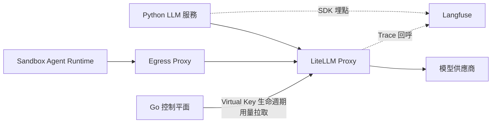

# ADR-017：模型閘道與 LLM 可觀測性（LiteLLM + Langfuse）

- 狀態：Accepted
- 日期：2026-08-13
- 決策者：產品負責人、架構規劃

## 背景

平台有兩類模型呼叫：Python LLM 服務的平台工作負載（ADR-013 增強、LLM Judge、改善建議），以及 Sandbox 內 Agent Runtime 試跑 Skill 時的模型呼叫。兩者都需要：模型供應商可抽換（ADR-000 品質屬性 3）、Run 級成本歸因（ADR-011 Usage Record）、短效憑證（ADR-005，Sandbox 不得持有長效金鑰）。

同時，LLM 工作負載需要工程側的觀測與調優（Prompt 迭代、Judge 品質、成本分析），這不屬於 ADR-009 已定義的三類資料（平台 O11y／Run Trace／Evaluation）中的任何一類。

選用元件：LiteLLM（模型閘道）與 Langfuse（LLM 可觀測性）。

## 評估選項（整合模式）

### LiteLLM：SDK 內嵌 vs Proxy 閘道

- SDK 內嵌 Python 服務：零額外部署，但 Sandbox 內的 Agent Runtime 無法使用（任意 Runtime，無法要求引入函式庫），且供應商金鑰散落各呼叫端。
- Proxy 閘道（採用）：獨立部署單元，所有模型呼叫（Python 服務與 Sandbox）走同一閘道；供應商金鑰只存在閘道；可簽發帶預算與 TTL 的 Virtual Key——這正好實作 ADR-005 要求的短效憑證。

### Langfuse：Cloud vs 自架

- 自架（v3）需要 ClickHouse＋Redis＋S3，違反 ADR-014「最少產品」原則。
- Cloud 起步（採用）：受管優先；資料駐留或成本成為問題時再評估自架（ADR-010 拆分觸發邏輯）。

## 決策

### LiteLLM Proxy 作為唯一模型出口

- 供應商 API Key 只保存在閘道；Python 服務與 Sandbox 只持有 Virtual Key。
- **每個 Run 一把短效 Virtual Key**：Go 在 provisioning 階段透過閘道管理 API 簽發（預算與 TTL 由 Policy 模組決定，ADR-011），注入 Sandbox（SBX-008 短效傳遞），Run 終止即撤銷。
- Run 成本歸因：Go 依 Virtual Key／`run_id` 標籤拉取閘道用量，寫入 Usage Record；閘道數據是計量來源之一，不是領域事實來源。
- 模型抽換與容錯（fallback、重試、路由）設定在閘道層，Python 程式碼不綁定供應商。
- 未來使用者自備 API Key（PDM-010）以閘道的 BYO Key 機制實作，平台程式碼不變。

### Langfuse 作為 LLM 工程可觀測性（ADR-009 的第四軌，且明確從屬）

| 資料 | 事實來源 | Langfuse 的角色 |
| --- | --- | --- |
| Run Trace（使用者可見） | 平台 Postgres（ADR-009／014） | 不經手 |
| Evaluation 結果 | Evaluation 模組（ADR-002） | 不經手；僅記錄 Judge 呼叫的過程數據 |
| 平台 O11y | OTel＋受管後端（ADR-014） | 不取代 |
| LLM 呼叫明細（Prompt、參數、延遲、成本、品質標註） | Langfuse | 唯一用途：工程調優與成本分析 |

- 埋點：Python 服務以 Langfuse SDK 埋點，LiteLLM 閘道以原生回呼補齊；一律附 `run_id` 關聯（ADR-009 Correlation 體系）。
- Langfuse 為平台工程專用工具，存取限工程身分；其中含使用者 Prompt 內容，視同生產機敏資料：Secrets 依 ADR-009 遮罩規則先行處理、Dataset 內容不送入、保存期限另定。
- Prompt 管理：平台 Prompt（Judge、增強、改寫）可用 Langfuse Prompt Management 迭代，但 SDK 快取加本地 fallback，Langfuse 不可用不得阻斷 Run；每次 Run 快照記錄實際使用的 Prompt 版本（併入 ADR-003 不可變快照清單）。
- Golden query set（PDM-011）與 Judge 品質回歸可用 Langfuse Datasets/Evals 承載。

## 邊界守則

1. Go 不做推理呼叫，只操作閘道管理 API（Key 生命週期、用量拉取）——ADR-016 守則不變。
2. Langfuse 與閘道的任何數據都不是領域事實來源；遺失或延遲不影響 Run 正確性。
3. Sandbox 對閘道的存取仍經 Egress Proxy 允許清單（ADR-005），閘道位址是少數預設允許目的地之一。
4. 閘道故障視為 Provider 級故障處理（ADR-004 失敗分類），不得讓呼叫端繞過閘道直連供應商。

## 影響

### 正面

- 短效模型憑證、Run 級成本歸因、供應商抽換、BYO Key 四個懸置需求由一個元件落地。
- Prompt 迭代與 Judge 調優有專用工具，不污染 Run Trace 與 Evaluation 的資料模型。
- LiteLLM 可與主 Postgres 共用實例（獨立 schema），不新增資料產品。

### 成本與限制

- 新增一個部署單元（閘道）且位於推理關鍵路徑，需要健康監控與容量規劃（O11Y-002 範圍）。
- 閘道成為模型呼叫單點；MVP 接受，多副本部署為現成緩解。
- Langfuse Cloud 有資料出境考量；資料駐留需求出現時觸發自架評估。

## 待決策

- LiteLLM 與主 Postgres 共用實例或獨立小實例。 **→ 已解決**：取「共用實例、獨立邏輯 database」——LiteLLM 的 `DATABASE_URL` 指向同一個 postgres 服務的 `litellm` database，`infra/compose/docker-compose.yml` 的註解逐字寫明理由（migration 不得互相波及）。
- Langfuse 保存期限與遮罩範圍的具體政策（隨 SEC-006）。
- Sandbox 內 Agent Runtime 注入 Virtual Key 的具體機制（環境變數 vs 設定檔，隨 PDM-003 Runtime 確認）。 **→ 已解決**：取環境變數。sandboxd 以 `ANTHROPIC_BASE_URL`／`ANTHROPIC_AUTH_TOKEN` 注入容器，平台側 preflight 以同一組名稱對使用者揭露，Trace 遮罩也以這兩個名稱為 pattern——三處同名，所以揭露、注入與遮罩不會各講各的。

## 補記（2026-08-29）：Langfuse 那一半在 MVP 沒有實作，而沒有任何一份清單記著它

**不改寫上方任何一段決策文字。** 本節只記錄一個事實與一個待簽。

**事實（逐項查證）**

- 本 ADR 決策段指定「Python 服務以 Langfuse SDK 埋點，LiteLLM 閘道以原生回呼補齊；一律附 `run_id` 關聯」，並規劃了 Prompt Management。
- `apps/llm/pyproject.toml` 的依賴是 `fastapi`／`uvicorn`／`litellm`／`openai`——**沒有 langfuse**；`apps/llm/src` 全樹沒有任何 langfuse import。
- `infra/compose/litellm-config.yaml` 的 `litellm_settings` 只有 `drop_params: true`，**沒有 `success_callback: ["langfuse"]`**；`docker-compose.yml` 全檔沒有任何 `LANGFUSE_*`。
- 四份活文件（`01`／`03`／`04`／`05`）對「Langfuse」的命中數在 2026-08-29 之前**各是 0**。`03` 的 `O11Y-001`～`004` 全部是 Prometheus 與產品分析事件，**沒有一項承接 LLM 可觀測性**。
- `AGENTS.md`「已定案的技術棧速覽」仍把它列為定案（同日已就地標註）。

**這不是安全問題。** 本 ADR 的邊界守則 2 已經把 Langfuse 排除在事實來源之外，而**確實沒有任何一行程式把它當真相讀**——逐檔確認過，這一點是乾淨的。問題是形狀：**一份 `Accepted` 的 ADR、一列技術棧、零個工作項、零個殘項**，也就是 `AGENTS.md` 開頭那句「一個事實好幾份定義」的完整版本。

**待負責人裁定 → [`05` R-24](../plans/05-pending-rulings.md)「Langfuse：做／不做／縮限」。** 三個選項與各自的代價寫在那裡；**不在本 ADR 代為選擇**，因為那會是原地改寫決策。

**裁定之後**：選「做」→ `03` 要有一個承接工作項；選「不做」或「縮限」→ **新增一份 ADR 取代或縮限本 ADR 觀測那一半**（號碼 ＝ [索引](README.md)最大號 ＋ 1），本文件原文不動、狀態不動。

**它承接的能力今天沒有替代品，值得記在旁邊**：本 ADR 指定 golden query set 與 Judge 品質回歸「可用 Langfuse Datasets/Evals 承載」，實際上那兩件事靠 `tools/eval-regression` 的一次性腳本與人工讀報告；而同期稽核抓到的「沒有任何一次模型呼叫釘住 temperature 或 seed」，正是這類工具最省事的用途。
