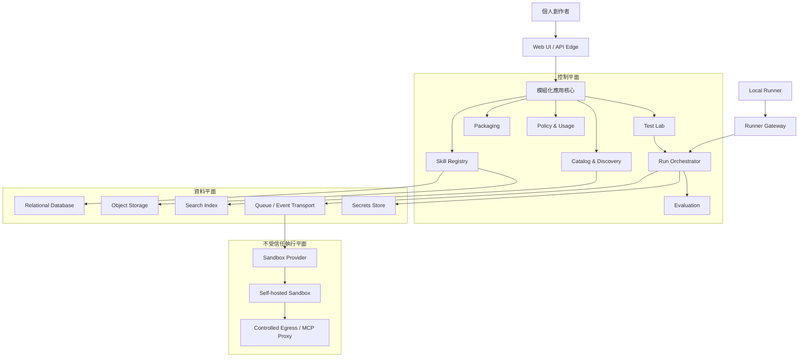

# Skill Hub 架構決策紀錄

- 日期：2026-08-13
- 範圍：Skill Hub MVP 與企業級演進基線
- 對應產品規劃：[MVP 規劃](../plans/mvp/README.md)

## 目的

本目錄保存 Skill Hub 的架構決策紀錄（Architecture Decision Records, ADR）。每份 ADR 聚焦一項可獨立評審的決策，說明背景、選項、決策、影響與後續工作。

ADR 是決策歷史，不是只描述最終系統狀態。若未來推翻既有決策，應新增 ADR 並將舊文件標記為 `Superseded`，而不是直接刪除舊紀錄。

## 狀態定義

| 狀態 | 意義 |
| --- | --- |
| Proposed | 已提出，等待架構或產品評審 |
| Accepted | 已同意採用，後續實作應遵循 |
| Rejected | 已評估但不採用 |
| Deprecated | 仍存在但不建議繼續使用 |
| Superseded | 已由新的 ADR 取代 |

## 決策索引

| ADR | 主題 | 狀態 |
| --- | --- | --- |
| [ADR-000](./ADR-000-system-context-and-quality-attributes.md) | 系統情境與架構品質屬性 | Accepted |
| [ADR-001](./ADR-001-modular-control-plane-and-isolated-execution-plane.md) | 模組化控制平面與隔離執行平面 | Accepted |
| [ADR-002](./ADR-002-domain-boundaries-and-ownership.md) | 領域邊界與模組責任 | Accepted |
| [ADR-003](./ADR-003-data-ownership-and-storage.md) | 資料所有權、儲存與生命週期 | Accepted |
| [ADR-004](./ADR-004-provider-neutral-run-orchestration.md) | Provider-neutral Run Orchestration | Accepted |
| [ADR-005](./ADR-005-self-hosted-sandbox-baseline.md) | 初期自建 Sandbox 與隔離基線 | Accepted |
| [ADR-006](./ADR-006-local-runner-for-local-resources.md) | Local Runner 與本機資源存取 | Accepted |
| [ADR-007](./ADR-007-trust-security-and-supply-chain.md) | 信任、安全區域與 Skill 供應鏈 | Accepted |
| [ADR-008](./ADR-008-asynchronous-workflows-and-domain-events.md) | 非同步工作流程與領域事件 | Accepted |
| [ADR-009](./ADR-009-observability-trace-and-evaluation-boundaries.md) | 平台 O11y、Run Trace 與評估邊界 | Accepted |
| [ADR-010](./ADR-010-mvp-deployment-and-evolution-path.md) | MVP 部署形態與服務拆分路徑 | Accepted |
| [ADR-011](./ADR-011-workspace-tenancy-policy-and-usage.md) | Workspace、多租戶準備、政策與用量 | Accepted |
| [ADR-012](./ADR-012-packaging-portability-and-agent-adapters.md) | 打包、可攜性與 Agent Adapter | Accepted |
| [ADR-013](./ADR-013-intent-search-architecture.md) | 意圖搜尋混合檢索與 LLM 增強 | Accepted |
| [ADR-014](./ADR-014-core-infrastructure-selection.md) | 核心基礎設施最小受管組合 | Superseded（由 [ADR-018](./ADR-018-containerized-core-infrastructure.md)） |
| [ADR-015](./ADR-015-sandbox-isolation-technology.md) | Sandbox 隔離技術（gVisor 基線） | Accepted |
| [ADR-016](./ADR-016-language-and-framework-selection.md) | 語言與框架（TS／Go／Python） | Accepted |
| [ADR-017](./ADR-017-model-gateway-and-llm-observability.md) | 模型閘道與 LLM 可觀測性（LiteLLM＋Langfuse） | Accepted |
| [ADR-018](./ADR-018-containerized-core-infrastructure.md) | 核心基礎設施容器化自架（E1 起步，取代 ADR-014） | Accepted |
| [ADR-019](./ADR-019-monorepo-structure-and-cicd.md) | Monorepo 目錄結構與 CI/CD | Proposed |
| [ADR-020](./ADR-020-authentication-and-session-model.md) | 身分驗證與 Session(GitHub OAuth＋Postgres Session) | Proposed |
| [ADR-021](./ADR-021-skill-license-provenance.md) | Skill License 溯源與多層 Provenance | Accepted |
| [ADR-022](./ADR-022-sandbox-deployment-topology-and-security-thresholds.md) | Sandbox 部署拓撲與安全驗收定值（含 Container registry 採 GHCR） | Accepted |
| [ADR-023](./ADR-023-agent-sdk-version-pinning-and-behaviour-revalidation.md) | Agent SDK 版本釘選與行為重驗政策（靜默失效不得以推理帶過） | Accepted |
| [ADR-024](./ADR-024-top-level-repository-layout.md) | 頂層目錄分「跑的」與「讀的」（文件收進 `docs/`，修訂 ADR-019 §1） | Superseded（由 [ADR-031](./ADR-031-artifact-role-repository-layout.md)） |
| [ADR-025](./ADR-025-run-terminal-state-and-evaluation-verdict-separation.md) | Run 終態與 Evaluation 判定的分離（評估不回寫 `runs.status`） | Accepted |
| [ADR-026](./ADR-026-evaluation-reassessment-evidence-lifetime-and-judge-trust-boundary.md) | Evaluation 的重評（append-only）、證據壽命與 LLM Judge 信任邊界（併入原規劃的 ADR-027） | Accepted |
| [ADR-027](./ADR-027-download-artifact-shape-reproducibility-and-integrity.md) | Download Artifact 的形狀、可重現性與完整性（雙雜湊、規範化 zip、**MVP 不簽章**、`skills.redistribution` 三態） | Accepted |
| [ADR-028](./ADR-028-beta-admission-and-quota-enforcement-points.md) | 封測准入與配額的強制點（允許清單疊在 OAuth 之上；配額強制點是平台計數器，不是閘道） | Accepted |
| [ADR-029](./ADR-029-product-analytics-events-and-audit-trace-boundaries.md) | 產品分析事件與 audit／Trace 的邊界（鐵律 11 的「分析事件」定義） | Accepted |
| [ADR-030](./ADR-030-portable-developer-automation-and-contract-code-generation.md) | 可攜式開發自動化與契約程式碼生成（Automation Contract、共享工作樹單一 Writer、OpenAPI 3.1 generator） | Accepted |
| [ADR-031](./ADR-031-artifact-role-repository-layout.md) | 依產物角色劃分頂層目錄（可啟動產品程式統一進 `apps/`，取代 ADR-024 收納語意） | Accepted |
| [ADR-032](./ADR-032-ddd-bounded-context-governance-for-platform.md) | Platform 的 DDD Bounded Context 治理與機械強制（補充 ADR-002；depguard 白名單＝context map 的 CI 表述） | Accepted |
| [ADR-033](./ADR-033-sqlc-query-ownership-and-cross-context-write-enforcement.md) | sqlc Query Ownership 與跨 Context 寫入強制（補充 ADR-032；`db/query-owners.yaml` ＋ `automation-check`，先鎖 write） | Accepted |
| [ADR-034](./ADR-034-cross-context-writes-close-by-inversion-not-by-events.md) | 剩餘跨 Context 寫入以依賴反轉收斂，不事件化（修訂 ADR-033 清除路徑 1、3；交易保證不換最終一致） | Accepted |
| [ADR-035](./ADR-035-read-ownership-enforcement-and-context-map-completeness.md) | Read Ownership 開始強制，Context 對照表補上完整性檢查（回答 ADR-033／034 待決策；`read_allow:` 棘輪＋ AGENTS.md 第 11 條的機械強制） | Accepted |
| [ADR-036](./ADR-036-real-browser-verification-tier.md) | 前端的真實瀏覽器驗證層：引入 Playwright 三引擎，否決人工走查落檔（層刻意窄，只測 jsdom 判定不了的合成像素／版面／Tab 鍵；OS 矩陣仍未做） | Accepted |
| [ADR-037](./ADR-037-product-analytics-and-package-architecture-identities.md) | Product Analytics 與 package architecture identity（修訂 ADR-002／032／035；Context Map、depguard 與 query ownership 共用 package mapping） | Accepted |
| [ADR-038](./ADR-038-platform-product-domain-language-and-value-stream-navigation.md) | Platform 產品領域語言與價值流導覽（雙軌 Context Map：產品領域名稱與 stable Boundary ID／現行 path 分離） | Accepted |
| [ADR-039](./ADR-039-frontend-design-system-and-ui-evaluation-criteria.md) | 前端設計系統與 UI/UX 評估準則（把 `index.css` 註解裡的隱性決策成文化，否決第三方設計系統；四層＝義務／原則／系統／強制對照表，含誠實的「沒有人把關」空格；手冊在 [docs/design/system.md](../design/system.md)） | Accepted |
| [ADR-040](./ADR-040-platform-foundation-shared-kernel-and-entrypoint-topology.md) | Platform 的 Foundation、Shared Kernel 與 Entrypoint 拓撲（保留 Go `internal` 私有邊界；將 Generic 技術基座與 HTTP 組裝收納為明確角色） | Accepted |
| [ADR-041](./ADR-041-trust-signal-vocabulary-typed-absence-and-rule-precedence.md) | 信任訊號的表達方式、缺席的型別與規則優先序（否決綜合信任分數——它必然把「沒檢查」映射到與「檢查過沒事」同一條軸；缺席固定六詞；原則牴觸時的順位；文件即政策、CSS 即事實、測試比對兩者） | Accepted |
| [ADR-042](./ADR-042-roadmap-product-rulings-evidence-aggregate-in-flight-axis-and-enforcer-attribution.md) | 路線圖上六個未決問題的產品裁定（評分與排行榜**永久不做**，替代品是帶分母的試跑證據彙總；進行中是第三軸；大清單的判準是「這一頁在問什麼」而不是列數；強制者必須具名；量測只在「對位元組成立」時可繼承） | Accepted |
| [ADR-043](./ADR-043-evidence-citation-is-verified-by-content-not-by-its-claimed-source.md) | 引用的成立條件是引文本身可回驗，來源標籤只是提示（修訂 ADR-026 defence 3 的判準：歸錯類的引用要改正而不是打回；`artifact` 引用只證明存在；正規化有界且比對結果分三態） | Accepted |
| [ADR-044](./ADR-044-agent-skills-specification-conformance.md) | Agent Skills 規格的釘選（agentskills.io，無版本號，以 commit＋blob SHA 釘選）、與參考實作衝突時的取捨、六個 frontmatter 欄位的完整判準，以及「符合規格」這句話可以說到哪裡（`INSTALL.md` 原本宣稱符合一份 repo 裡不存在的規格）；同批補上打包器移除檔案的揭露與「平台弄壞的引用要擋下來」 | Accepted |
| [ADR-045](./ADR-045-self-supplied-content-is-not-redistribution.md) | 把一個工作區自己帶進來的位元組交還給它不是「再散布」，所以 `skills.redistribution` 多一個 `self_supplied`——使用者第一次下載得了自己的 Skill；判準是「誰的工作區」而不是「是不是上傳」（策展目錄走同一個上傳端點），且刻意不寫成 `allowed`，好讓日後的發佈路徑必須停下來要求判定 | Accepted |
| [ADR-047](./ADR-047-generation-path-rulings-retry-truncation-and-quota.md) | 生成路徑的五個裁定（回答 ADR-046 的全部待決策）：**單次重試且平台不修改模型交出的位元組**（來源紀錄必須重現得出那份套件，否則一個事實有兩份定義）、`max_tokens` 提到 16000 且**截斷是另一個失敗類別不重試**、**額度按「一次生成」計不按呼叫計且失敗不扣**、生成物維持不進目錄但把它換成三個可檢核的前置、**生成物可以當 Fork 的來源因為阻擋它才要寫程式** | Accepted |
| [ADR-046](./ADR-046-generating-a-skill-from-a-task-description.md) | 從任務描述生成 Skill——**生成物是工作區私有，不是目錄的第四層**：`tier` 三態全是「經過多少人工檢視」的階梯，生成物一格都不符合，於是不進目錄也不進搜尋索引；新增獨立的 `/v1/generate-skill` 而**不放寬改善迴圈的 prompt**（引文回驗在「從零」上整條落空）；`redistribution` 多一個 `generated`（判準同 ADR-045，但與 `self_supplied` 分開，因為「能不能發佈到目錄」的答案不會一樣）；**生成器不得寫 `license` 欄位**——模型編出來的宣告不得佔用「已宣告」這個狀態 | Accepted |

## 整體架構摘要

## 核心架構原則

1. 不受信任的 Skill、Script、資料與工具輸出不可在主要 Web/API 程序內執行。
2. 控制平面負責決策與治理；執行平面只取得一次 Run 所需的最小短效權限。
3. Skill Version、Test Case 與 Run 輸入皆以不可變快照確保可重現性。
4. Provider、模型、Agent Runtime、搜尋來源與儲存實作均透過明確邊界抽換。
5. 平台永久 ID 與外部 Provider 臨時 ID 分離。
6. 使用者可見 Run Trace 與平台基礎設施 Observability 分開管理。
7. MVP 採可演進的模組化架構；只在負載、組織或安全需求成立時拆服務。
8. 每筆使用者資料從第一天就具備 Workspace 邊界，即使 MVP 只有個人工作區。

## 評審與維護方式

- 每份 `Proposed` ADR 應在實作對應工作前完成評審。
- ADR 的重大待決策事項應同步回寫至 [MVP 工作項目](../plans/03-work-items.md)。
- 實作與 ADR 不一致時，應先確認是實作偏離，還是架構決策需要更新。
- 技術選型應另外新增 ADR；本批文件優先定義穩定的架構邊界，而非提前鎖定產品或雲端供應商。
