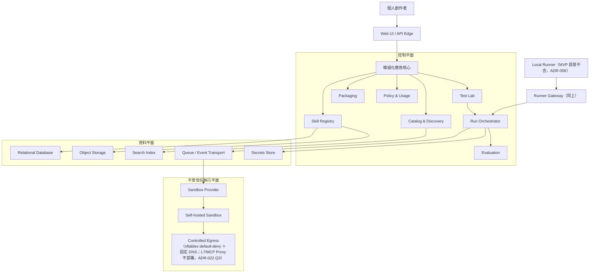

# Skill Hub 架構決策紀錄

- 日期：2026-08-13
- 範圍：Skill Hub MVP 與企業級演進基線
- 對應產品規劃：[MVP 規劃](../plans/mvp/README.md)

## 目的

本目錄保存 Skill Hub 的架構決策紀錄（Architecture Decision Records, ADR）。每份 ADR 聚焦一項可獨立評審的決策，說明背景、選項、決策、影響與後續工作。

ADR 是決策歷史，不是只描述最終系統狀態。若未來推翻既有決策，應新增 ADR 並將舊文件標記為 `Superseded`，而不是直接刪除舊紀錄。

## 狀態定義

| 狀態 | 意義 |
| --- | --- |
| Proposed | 已提出，等待架構或產品評審 |
| Accepted | 已同意採用，後續實作應遵循 |
| Rejected | 已評估但不採用 |
| Deprecated | 仍存在但不建議繼續使用 |
| Superseded | 已由新的 ADR 取代 |

## 決策索引

| ADR | 主題 | 狀態 |
| --- | --- | --- |
| [ADR-000](./ADR-000-system-context-and-quality-attributes.md) | 系統情境與架構品質屬性 | Accepted |
| [ADR-001](./ADR-001-modular-control-plane-and-isolated-execution-plane.md) | 模組化控制平面與隔離執行平面 | Accepted |
| [ADR-002](./ADR-002-domain-boundaries-and-ownership.md) | 領域邊界與模組責任 | Accepted |
| [ADR-003](./ADR-003-data-ownership-and-storage.md) | 資料所有權、儲存與生命週期 | Accepted |
| [ADR-004](./ADR-004-provider-neutral-run-orchestration.md) | Provider-neutral Run Orchestration | Accepted |
| [ADR-005](./ADR-005-self-hosted-sandbox-baseline.md) | 初期自建 Sandbox 與隔離基線 | Accepted |
| [ADR-006](./ADR-006-local-runner-for-local-resources.md) | Local Runner 與本機資源存取 | Accepted |
| [ADR-007](./ADR-007-trust-security-and-supply-chain.md) | 信任、安全區域與 Skill 供應鏈 | Accepted |
| [ADR-008](./ADR-008-asynchronous-workflows-and-domain-events.md) | 非同步工作流程與領域事件 | Accepted |
| [ADR-009](./ADR-009-observability-trace-and-evaluation-boundaries.md) | 平台 O11y、Run Trace 與評估邊界 | Accepted |
| [ADR-010](./ADR-010-mvp-deployment-and-evolution-path.md) | MVP 部署形態與服務拆分路徑 | Accepted |
| [ADR-011](./ADR-011-workspace-tenancy-policy-and-usage.md) | Workspace、多租戶準備、政策與用量 | Accepted |
| [ADR-012](./ADR-012-packaging-portability-and-agent-adapters.md) | 打包、可攜性與 Agent Adapter | Accepted |
| [ADR-013](./ADR-013-intent-search-architecture.md) | 意圖搜尋混合檢索與 LLM 增強 | Accepted |
| [ADR-014](./ADR-014-core-infrastructure-selection.md) | 核心基礎設施最小受管組合 | Superseded（由 [ADR-018](./ADR-018-containerized-core-infrastructure.md)） |
| [ADR-015](./ADR-015-sandbox-isolation-technology.md) | Sandbox 隔離技術（gVisor 基線） | Accepted |
| [ADR-016](./ADR-016-language-and-framework-selection.md) | 語言與框架（TS／Go／Python） | Accepted |
| [ADR-017](./ADR-017-model-gateway-and-llm-observability.md) | 模型閘道與 LLM 可觀測性（LiteLLM＋Langfuse） | Accepted |
| [ADR-018](./ADR-018-containerized-core-infrastructure.md) | 核心基礎設施容器化自架（E1 起步，取代 ADR-014） | Accepted |
| [ADR-019](./ADR-019-monorepo-structure-and-cicd.md) | Monorepo 目錄結構與 CI/CD | Accepted |
| [ADR-020](./ADR-020-authentication-and-session-model.md) | 身分驗證與 Session(GitHub OAuth＋Postgres Session) | Accepted |
| [ADR-021](./ADR-021-skill-license-provenance.md) | Skill License 溯源與多層 Provenance | Accepted |
| [ADR-022](./ADR-022-sandbox-deployment-topology-and-security-thresholds.md) | Sandbox 部署拓撲與安全驗收定值（含 Container registry 採 GHCR） | Accepted |
| [ADR-023](./ADR-023-agent-sdk-version-pinning-and-behaviour-revalidation.md) | Agent SDK 版本釘選與行為重驗政策（靜默失效不得以推理帶過） | Accepted |
| [ADR-024](./ADR-024-top-level-repository-layout.md) | 頂層目錄分「跑的」與「讀的」（文件收進 `docs/`，修訂 ADR-019 §1） | Superseded（由 [ADR-031](./ADR-031-artifact-role-repository-layout.md)） |
| [ADR-025](./ADR-025-run-terminal-state-and-evaluation-verdict-separation.md) | Run 終態與 Evaluation 判定的分離（評估不回寫 `runs.status`） | Accepted |
| [ADR-026](./ADR-026-evaluation-reassessment-evidence-lifetime-and-judge-trust-boundary.md) | Evaluation 的重評（append-only）、證據壽命與 LLM Judge 信任邊界（併入原規劃的 ADR-027） | Accepted |
| [ADR-027](./ADR-027-download-artifact-shape-reproducibility-and-integrity.md) | Download Artifact 的形狀、可重現性與完整性（雙雜湊、規範化 zip、**MVP 不簽章**、`skills.redistribution` 三態） | Accepted |
| [ADR-028](./ADR-028-beta-admission-and-quota-enforcement-points.md) | 封測准入與配額的強制點（允許清單疊在 OAuth 之上；配額強制點是平台計數器，不是閘道） | Accepted |
| [ADR-029](./ADR-029-product-analytics-events-and-audit-trace-boundaries.md) | 產品分析事件與 audit／Trace 的邊界（鐵律 11 的「分析事件」定義） | Accepted |
| [ADR-030](./ADR-030-portable-developer-automation-and-contract-code-generation.md) | 可攜式開發自動化與契約程式碼生成（Automation Contract、共享工作樹單一 Writer、OpenAPI 3.1 generator） | Accepted |
| [ADR-031](./ADR-031-artifact-role-repository-layout.md) | 依產物角色劃分頂層目錄（可啟動產品程式統一進 `apps/`，取代 ADR-024 收納語意） | Accepted |
| [ADR-032](./ADR-032-ddd-bounded-context-governance-for-platform.md) | Platform 的 DDD Bounded Context 治理與機械強制（補充 ADR-002；depguard 白名單＝context map 的 CI 表述） | Accepted |
| [ADR-033](./ADR-033-sqlc-query-ownership-and-cross-context-write-enforcement.md) | sqlc Query Ownership 與跨 Context 寫入強制（補充 ADR-032；`db/query-owners.yaml` ＋ `automation-check`，先鎖 write） | Accepted |
| [ADR-034](./ADR-034-cross-context-writes-close-by-inversion-not-by-events.md) | 剩餘跨 Context 寫入以依賴反轉收斂，不事件化（修訂 ADR-033 清除路徑 1、3；交易保證不換最終一致） | Accepted |
| [ADR-035](./ADR-035-read-ownership-enforcement-and-context-map-completeness.md) | Read Ownership 開始強制，Context 對照表補上完整性檢查（回答 ADR-033／034 待決策；`read_allow:` 棘輪＋ AGENTS.md 第 11 條的機械強制） | Accepted |
| [ADR-036](./ADR-036-real-browser-verification-tier.md) | 前端的真實瀏覽器驗證層：引入 Playwright 三引擎，否決人工走查落檔（層刻意窄，只測 jsdom 判定不了的合成像素／版面／Tab 鍵；OS 矩陣仍未做） | Accepted |
| [ADR-037](./ADR-037-product-analytics-and-package-architecture-identities.md) | Product Analytics 與 package architecture identity（修訂 ADR-002／032／035；Context Map、depguard 與 query ownership 共用 package mapping） | Accepted |
| [ADR-038](./ADR-038-platform-product-domain-language-and-value-stream-navigation.md) | Platform 產品領域語言與價值流導覽（雙軌 Context Map：產品領域名稱與 stable Boundary ID／現行 path 分離） | Accepted |
| [ADR-039](./ADR-039-frontend-design-system-and-ui-evaluation-criteria.md) | 前端設計系統與 UI/UX 評估準則（把 `index.css` 註解裡的隱性決策成文化，否決第三方設計系統；四層＝義務／原則／系統／強制對照表，含誠實的「沒有人把關」空格；手冊在 [docs/design/system.md](../design/system.md)） | Accepted |
| [ADR-040](./ADR-040-platform-foundation-shared-kernel-and-entrypoint-topology.md) | Platform 的 Foundation、Shared Kernel 與 Entrypoint 拓撲（保留 Go `internal` 私有邊界；將 Generic 技術基座與 HTTP 組裝收納為明確角色） | Accepted |
| [ADR-041](./ADR-041-trust-signal-vocabulary-typed-absence-and-rule-precedence.md) | 信任訊號的表達方式、缺席的型別與規則優先序（否決綜合信任分數——它必然把「沒檢查」映射到與「檢查過沒事」同一條軸；缺席固定六詞；原則牴觸時的順位；文件即政策、CSS 即事實、測試比對兩者） | Accepted |
| [ADR-042](./ADR-042-roadmap-product-rulings-evidence-aggregate-in-flight-axis-and-enforcer-attribution.md) | 路線圖上六個未決問題的產品裁定（評分與排行榜**永久不做**，替代品是帶分母的試跑證據彙總；進行中是第三軸；大清單的判準是「這一頁在問什麼」而不是列數；強制者必須具名；量測只在「對位元組成立」時可繼承） | Accepted |
| [ADR-043](./ADR-043-evidence-citation-is-verified-by-content-not-by-its-claimed-source.md) | 引用的成立條件是引文本身可回驗，來源標籤只是提示（修訂 ADR-026 defence 3 的判準：歸錯類的引用要改正而不是打回；`artifact` 引用只證明存在；正規化有界且比對結果分三態） | Accepted |
| [ADR-044](./ADR-044-agent-skills-specification-conformance.md) | Agent Skills 規格的釘選（agentskills.io，無版本號，以 commit＋blob SHA 釘選）、與參考實作衝突時的取捨、六個 frontmatter 欄位的完整判準，以及「符合規格」這句話可以說到哪裡（`INSTALL.md` 原本宣稱符合一份 repo 裡不存在的規格）；同批補上打包器移除檔案的揭露與「平台弄壞的引用要擋下來」 | Accepted |
| [ADR-045](./ADR-045-self-supplied-content-is-not-redistribution.md) | 把一個工作區自己帶進來的位元組交還給它不是「再散布」，所以 `skills.redistribution` 多一個 `self_supplied`——使用者第一次下載得了自己的 Skill；判準是「誰的工作區」而不是「是不是上傳」（策展目錄走同一個上傳端點），且刻意不寫成 `allowed`，好讓日後的發佈路徑必須停下來要求判定 | Accepted |
| [ADR-046](./ADR-046-generating-a-skill-from-a-task-description.md) | 從任務描述生成 Skill——**生成物是工作區私有，不是目錄的第四層**：`tier` 三態全是「經過多少人工檢視」的階梯，生成物一格都不符合，於是不進目錄也不進搜尋索引；新增獨立的 `/v1/generate-skill` 而**不放寬改善迴圈的 prompt**（引文回驗在「從零」上整條落空）；`redistribution` 多一個 `generated`（判準同 ADR-045，但與 `self_supplied` 分開，因為「能不能發佈到目錄」的答案不會一樣）；**生成器不得寫 `license` 欄位**——模型編出來的宣告不得佔用「已宣告」這個狀態 | Accepted |
| [ADR-047](./ADR-047-generation-path-rulings-retry-truncation-and-quota.md) | 生成路徑的五個裁定（回答 ADR-046 的全部待決策）：**單次重試且平台不修改模型交出的位元組**（來源紀錄必須重現得出那份套件，否則一個事實有兩份定義）、`max_tokens` 提到 16000 且**截斷是另一個失敗類別不重試**、**額度按「一次生成」計不按呼叫計且失敗不扣**、生成物維持不進目錄但把它換成三個可檢核的前置、**生成物可以當 Fork 的來源因為阻擋它才要寫程式** | Accepted |
| [ADR-048](./ADR-048-not-every-blocking-finding-is-a-random-slip.md) | 不是每一個阻擋級 finding 都是隨機手滑（修訂 ADR-047 決策 1 的適用範圍）：`SeverityError` 有 12 個 code 而非文件列舉的 11 條結構檢查，第 12 個 `possible-secret` 比對的是**檔案內容**；一個模型在範例裡寫出憑證樣式是寫作習慣不是手滑，**重試會原樣重現**，所以它不重試、直接失敗。那句「阻擋級都是結構性的」被抄了三份，同批訂正 | Accepted |
| [ADR-049](./ADR-049-citation-verification-matches-the-stored-value-not-its-encoding.md) | 引用回驗的比對對象從「payload 的原始 JSON 文字」擴為「原始文字**加上**其中每個字串值解碼後的內容」——`EVAL-013` B 輪量到 5／22 個 rubric 項被降級,原因全是同一個:Judge 讀到 `\n` 就寫成真換行,而 payload 裡它是兩個字元,**同一個事實的兩種呈現,看的和驗的不是同一份**。解碼後的值不是新材料,所以這不是放寬;欄位間以 NUL 相接,跨欄位命中結構上不可能。**刻意不改「一則壞引用拖垮整條準則」**——支持放寬的證據(那 5 筆的壞引用其實不是捏造)在放寬之前就被本 ADR 移除了 | Accepted |
| [ADR-050](./ADR-050-beta-runs-in-parallel-with-the-sandbox-acceptance.md) | 負責人裁定**甲類四項不是封測 D 日的阻擋項,封測與 SEC-009／SBX-010 驗收並行**,縮小 ADR-015 定案紀錄「未通過不得開放外部使用者提交 Skill 執行」那一句的適用範圍(ADR-015 其餘不變、不 Superseded)。**這是接受一個風險不是解決一個問題**:在甲類通過前,不受信任程式碼會在逃逸邊界尚未驗證的節點上執行,45 項覆蓋此時 0 項 pass、`gvisor-baseline.txt` 仍是 `unset`、P-02 常駐探針不存在。刻意寫下三件事:①這個裁定**沒有**授權把封測擴大為公開註冊(12 位具名受邀者是它敢下的理由之一);②**Suite 1 只要 Linux＋Docker＋runsc,在那台節點跑一次是一天的事**,「全部到期」與「什麼都不做」之間不是只有兩個選項;③同意書必須據實說明執行環境尚未完成逃逸驗收。**待決策留了三條,其中第一條沒有答案就等於「否」** | Accepted |
| [ADR-051](./ADR-051-the-cheaper-model-generated-better-packages.md) | 便宜 21 倍的那個模型產出更好——生成的預設改為 mini（修訂 ADR-047 決策 5，該決策自己寫好了解鎖條件）：實測 mini 通過 **19／20** 對 flagship 的 16／20，每次 $0.00553 對 $0.1186；機制是失敗全落在 frontmatter 鍵名的字元級瑕疵上，而 mini 少寫 3.5 倍的 token，暴露面較小。**同批記下兩件不假裝知道的事**：mini 一次腳本都沒寫（哪一種更有用要靠試跑與人），以及重試後仍有 10% 殘餘失敗、UI 不得承諾成功率 | Accepted |
| [ADR-052](./ADR-052-m5-starts-in-parallel-with-an-unfinished-mvp.md) | M5 與未完成的 MVP 並行——三個啟動條件全部暫時放行（與 ADR-050 同型：**一個被明示接受的風險，不是一個被解決的問題**）。被移除的是「阻擋」這個效力，三項的事實一件都沒改變。**唯一的硬邊界是「開工不等於曝光」**：生成入口不得對封測使用者出現，否則 `01` §11.2 第一段量到的就不再是搜尋好不好，而那個數字只有一次機會、封測只有 12 個人。ADR 原本自承旗標靠預設值與紀律、沒有任何機制會告訴我們它被誤開過——**該項已於 2026-08-23 在 ADR-052 內回填答案：有，而且已經在跑**（`audit.ActionFeatureFlags` / `feature_flags.roster`，每次 API 啟動寫一次，everything-off 也寫）。**紀律那一半沒有變**：稽核事件記的是「這個部署的設定是什麼」，不擋任何人把旗標打開 | Accepted |
| [ADR-053](./ADR-053-the-assumption-under-m5-gets-its-own-five-people.md) | ADR-046 底下那個零證據的假設（搜不到的人會想要一個被做出來）**脫離 D 日單獨問 5 個人**，並成為 M5 的投入上限：ADR-052 放行了開工，而曝光旗標擋得住「使用者看得到」、**擋不住投入**——這是路線圖上唯一一個「越晚知道越貴」的風險。訊號前只做丟得掉的部分（契約 schema、`redistribution` 值域、量測），管線與 UI 暫停；三段門檻（0／1～2／3+）**寫在問之前** | Accepted |
| [ADR-054](./ADR-054-the-cap-was-lifted-by-authorisation-not-by-evidence.md) | ADR-053 的投入上限解除、M5 全面開工——**但解除它的是授權不是證據**：該 ADR 訂的解除條件是「5 人中 3 人自發說要做一個」，而那 5 個人一次都沒被問過，**ADR-046 底下那個假設今天的證據量仍然是零**。`ask-5` 從 gate 變成 check（0／5 的後果從「停在契約層」變成「重開 ADR-046 並且知道要丟」），曝光旗標不受影響 | Accepted |
| [ADR-055](./ADR-055-the-run-allowance-is-turned-off-and-that-took-an-action.md) | 免費 Run 額度關閉——**而「不限制」不是維持現狀，是一個動作**：`RUN_QUOTA` 未設是**用提案值強制**（未設的保存期限代表不蒐集是安全的；未設的額度代表唯一成本上限是開的，不安全），`off` 才是關。被關掉的是**次數**不是每次的成本——每 Run 仍有 `max_budget $0.50` 與 300K／60K token 上限，所以暴險是「次數無上限 × 每次 $0.50」；顯示與強制一起關（乙-2），同意書裡那句「額度用完會擋下」已改掉 | Accepted |
| [ADR-056](./ADR-056-the-generation-allowance-is-its-own-switch-and-it-is-off.md) | 生成額度是**第二個開關** `GENERATE_QUOTA`（一個開關關掉兩個額度＝ADR-047 決策 5 裁掉的共用池換套衣服），語意與 `RUN_QUOTA` 逐字相同：未設＝強制、`off`＝不強制且不顯示；四個數（每日 10／每窗 30／首窗 20／30 天）**全部待追認**，依 ADR-028 決策 4「先建點、後追認」，**追認前不得畫在畫面上**。依同日「額度先不限制」的裁示設為 `off`。**與 Run 不同的兩點寫進表**：一次生成 $0.0055 便宜一個量級，且**失敗天生不計費**——計數是數 `skill_sources` 的列，沒有餘額可以扣就沒有東西會扣錯 | Accepted |
| [ADR-057](./ADR-057-releasing-content-takes-named-evidence-not-a-button.md) | 把**別人的**內容標成可散布（ADR-045 之後只剩這一半）：**誰能改＝只有 operator**，理由不是保守而是 ADR-021 §5.3——那兩份合法的 MIT 涵蓋了不屬於作者的內容，**連做過查核的人都判錯，交給按鈕的人不會更準**；**要什麼證據＝具名的 `license_expression` ＋ `license_source`，且必須與最新版本凍結的快照相符**，不符就當場否定。**買到的不是「證明」是「可以被反駁」**。三種拒絕刻意是三句話（沒填／快照沒記／填了不符——中間那一個不能靠再猜一次繞過）；只有 `allowed` 要證據（為了「擋」而先做判定＝對拒絕做判定收費）；**稽核記快照的值不是操作者打的字**（第一次跑就以 `MANIFEST` 進了 trail，而查詢要對的正是那一格） | Accepted |
| [ADR-058](./ADR-058-the-clean-test-mode-is-real-postgres-behind-the-api-seam.md) | 乾淨測試模式用**真** PostgreSQL（PGlite，實測 42/42 且不可變性 trigger 真的擋人），不用任何形式的假資料層（SQLite 實測 0/42）；**Adapter 畫在 `apiFetch` 不畫在資料庫層**——衝突不在 SQL 而在連線數。判準一：任何候選必須能讓 `UPDATE skill_versions` 失敗。**決策 2／3 已由 ADR-060 推翻，決策 1／4／5 延續；本檔的量測全部仍然有效** | **Superseded by ADR-060** |
| [ADR-059](./ADR-059-the-clean-mode-execution-driver-is-honest-about-not-being-a-sandbox.md) | 乾淨測試模式的執行 Driver 宣告 `isolation.level = "clean"`——**那個名字的意思是「沒有邊界」不是「比較弱的邊界」**，開關是自己的變數不是 `DEV_LOGIN`；**派送閘門從黑名單改成白名單**（舊寫法讓 `gvsior` 與 `gvisor` 待遇相同）；**不引入第三方行程管理相依**——沒有真正跨平台的成熟選項，而最像的那一個在 Windows 上是空殼（實測只殺父行程會留下存活的孫行程） | Accepted |
| [ADR-060](./ADR-060-the-clean-test-mode-is-the-real-system-with-three-strategies-swapped.md) | **取代 ADR-058 的決策 2／3**：淨測試模式是**同一套產品程式以旗標切換三個實作**（資料庫、檔案、沙箱），不是瀏覽器裡的另一個系統——旗標未設時行為與今天逐位元相同。讓它成立的是**單行程 ＋ River `PollOnly`**（實測：一條連線上工作被領走、查詢同時服務；關掉 PollOnly 即紅）。隨之撤回 `PORT-002`／`PORT-006`、改寫 `PORT-005`。`pgmock` 記為備援（多 session 已實測，缺口是 32-bit pgvector） | Accepted |
| [ADR-061](./ADR-061-the-clean-mode-release-lives-on-the-keyboard-not-in-the-product.md) | 淨測試模式下**放行一個未策展版本的開關，長在啟動 launcher 的鍵盤上而不在產品 UI 裡**：該模式跑在 `DEV_LOGIN=1` 上，**任何到得了頁面的人都能以任何身分登入（含 operator）**，所以一個「允許不經沙箱執行」的按鈕按得動它的人包含剛上傳那個 Skill 的人——`02:SEC-011` 對單人團隊的 operator 名冊已經給過同一個答案（授予＝改部署環境）。**逐 version 不逐 skill**（否則下一次推版自動放行沒人看過的位元組）；**沒有具名理由的那一行不算放行**（理由就是控制本身）；紀錄是檔案＋每次使用的 `slog.Warn`，**刻意不寫 DB audit**（該模式的載體是記憶體內 PGlite，關機即失）。隨之改寫 `02:PORT-010` 第 5 條——「只跑策展素材」自此不再逐字為真 | Accepted |
| [ADR-062](./ADR-062-account-purge-waits-for-in-flight-private-writes.md) | 帳號清除與所有私人資料 producer 共用 Workspace 寫入 fence；先等 Run 終態且 sandbox cleanup 完成，再進入不可逆清除。Run 物件由 Attempt 推導補齊，Skill package 在 Put 前留下 durable collection intent | Accepted |
| [ADR-063](./ADR-063-account-purge-fence-rollout-requires-a-drain.md) | 帳號清除 fence 上線採停止舊 Maintenance、排空舊 Worker、等待 grant TTL 後修復 legacy marker 的強制順序 | Accepted |
| [ADR-064](./ADR-064-the-visual-layer-is-hierarchy-carried-by-tokens.md) | 線框感的來源是「**畫面上沒有任何東西比別的東西重要**」，不是缺顏色——所以視覺層的目的是**層級**，判準是 `system.md` §0 而不是品味。**延續 ADR-039 對第三方框架的否決**（再加兩條：框架預設外觀＝跟大家一樣；框架自帶的語意色會填滿 ADR-042 路線圖還在等的頻道）。做法是在 `index.css` 的 token 區塊加七個角色（面、互動態、強邊框、主要動作、阻斷底），深度用三層表面不用陰影（深色模式唯一成立的做法），**主張用描邊、動作用填色、一頁一個主要動作**，動效兩個時長一個曲線且 `prefers-reduced-motion` 在 token 層歸零；不引入 webfont、不做漸層、不做成功綠、不做主題切換。綁得到既有規則的三件（1.4.11 邊框、主要動作、阻斷 notice）是修缺陷；其餘是順位 5，**`05` R-38 同日放行、同日落地**；09-11～09-20 閘門期間一律不動 | Accepted |
| [ADR-065](./ADR-065-hot-path-text-budget-and-the-fourth-disclosure-mechanism.md) | 熱路徑的文字預算：**先量再裁**——畫面的重量不是教學而是「同一句話印了 N 次」（首頁四句 `note` 逐列印 45 次約 6,000 字、評估頁回驗解釋 232 字、打包頁 381 字是詳情頁複本），而 `.note` 同時裝但書與教學所以不是可行動的指標。做法是**依文字類別分流**：判斷依據／原因／但書／限制／進行中一個字不動，只有說明與識別符入預算（平鋪 D＋F ≤ A＋B＋C）；三條去重（逐列複述提到清單層級、`title` 與可見字同字算兩次、跨頁複本待簽）；**Tip 是 §1.3 的第四種揭露機制**（點擊觸發的 toggletip，只裝「為什麼」、錨點自己成立、不得是 `title` 或 hover、一頁 ≤3）；標籤化與至多六個形狀的 inline SVG 圖示（永遠伴隨文字，回答 ADR-064 待決策 3）；「看過一次就收」＝對所有人預設收合，**ADR-042 決策 5 不變**。只改文件，落地記 `04` 丙-142，三題待簽記 `05` R-42 | Accepted |
| [ADR-066](./ADR-066-generation-takes-a-diagram-or-reference-skills-as-input.md) | 生成的輸入多兩種——流程圖與參考既有 Skill，輸出路徑不變：三種模式（白話描述／上傳流程圖／參考既有 Skill＋描述）共用同一條 `apps/llm` 端點與 Go 驗證路徑，`redistribution` 仍是 `generated`——**參考是模型讀過的材料，不是套件裡的位元組**，所以不繼承來源 Skill 的授權狀態，也不構成版本鏈（縮限 ADR-046 決策 3 對「輸入」的範圍，決策 5 不變）；可參考的 Skill 限呼叫者讀得到、未下架、未受限、`redistribution≠blocked`；流程圖只留 sha256／media_type／bytes 三個數位指紋，**位元組本身不落地**，SVG 拒收（三種點陣格式 PNG／JPEG／WebP）；曝光邊界（`GENERATE_SKILL_EXPOSED`、兩個既有掛載點、首頁不新增入口）逐字不變。裁定 [`05` R-41](../plans/05-pending-rulings.md) 為 (b) | Accepted |
| [ADR-067](./ADR-067-interactive-skill-creation-with-langgraph.md) | 互動式 Skill 創作以 LangGraph 編排、Go／Postgres 保存版本化會話快照與事件；固定 workflow 加有界 ReAct、工具由 Go scoped 執行，最終保存綁定草稿 revision／雜湊。規劃已同意、尚未實作，不採 Python checkpoint 或第二套 Run 狀態。 | Accepted |

## 整體架構摘要

> **2026-09-03 訂正**：這張圖是**目標架構**，不是今天跑著的系統。兩處以現在式畫了 MVP 首發不含的東西，已在節點名稱上標明：**Local Runner**（AGENTS.md：「Local Runner 與遠端 MCP 已移出 MVP 首發」，決策保留於 ADR-006）與 **MCP Proxy**（ADR-022 Q3 決定沙箱層採 nftables default-deny ＋固定 DNS，**不部署 L7 Proxy**）。圖的其餘部分不變。

## 核心架構原則

1. 不受信任的 Skill、Script、資料與工具輸出不可在主要 Web/API 程序內執行。
2. 控制平面負責決策與治理；執行平面只取得一次 Run 所需的最小短效權限。
3. Skill Version、Test Case 與 Run 輸入皆以不可變快照確保可重現性。
4. Provider、模型、Agent Runtime、搜尋來源與儲存實作均透過明確邊界抽換。
5. 平台永久 ID 與外部 Provider 臨時 ID 分離。
6. 使用者可見 Run Trace 與平台基礎設施 Observability 分開管理。
7. MVP 採可演進的模組化架構；只在負載、組織或安全需求成立時拆服務。
8. 每筆使用者資料從第一天就具備 Workspace 邊界，即使 MVP 只有個人工作區。

## 評審與維護方式

- 每份 `Proposed` ADR 應在實作對應工作前完成評審。
- ADR 的重大待決策事項應同步回寫至 [MVP 工作項目](../plans/03-work-items.md)。
- 實作與 ADR 不一致時，應先確認是實作偏離，還是架構決策需要更新。
- 技術選型應另外新增 ADR；本批文件優先定義穩定的架構邊界，而非提前鎖定產品或雲端供應商。
