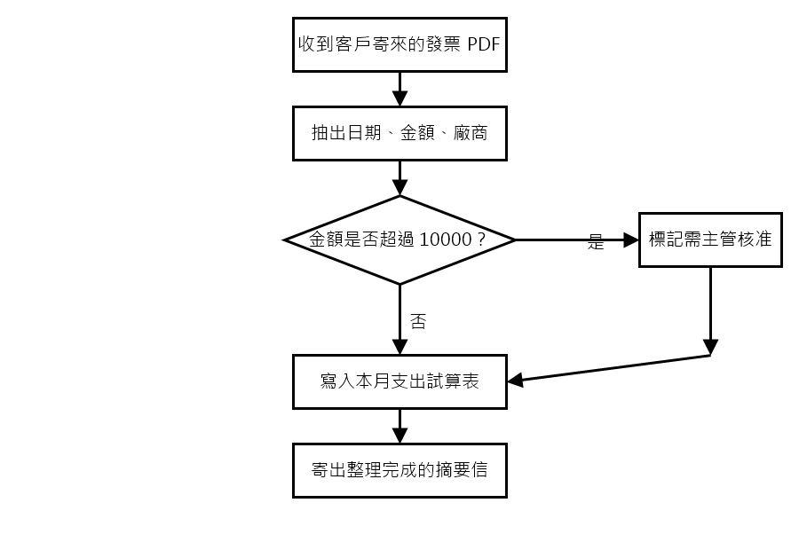

# 生成的三種輸入模式，各對真實閘道跑一次（2026-09-05）

[ADR-066](../../../adr/ADR-066-generation-takes-a-diagram-or-reference-skills-as-input.md) 落地當天的付費驗證。三種模式（`02:GEN-001` 純文字、`02:GEN-005` 只有流程圖、`02:GEN-006` 描述＋參考 Skill）各對真實 LiteLLM 閘道跑一次，走的是 Go 的 `ingest.Service.GenerateSkill` → `apps/llm` → 閘道 → 打包 → `skillpkg.Validate` → 建版這整條路，沒有任何一段是替身。這份報告只回答兩個問題：**路通不通**，以及**模型有沒有真的讀那張圖／那份參考**。品質不在此判定——三份產出都沒有被任何人試跑過，`GEN-004` 的「尚未試跑」狀態逐字適用。

## 1. 怎麼跑

- 閘道：本機 `skillhub-litellm-1`；金鑰是 `/key/generate` 簽的 Virtual Key（限 `gpt-5.4-mini`、預算 US$0.5、2 小時），跑完 `/key/delete` 撤銷，scratchpad 副本刪除。
- `apps/llm`：`uv run uvicorn skillhub_llm.app:app --port 8081`，`LITELLM_API_KEY` 是那把 Virtual Key（`gateway.py` 自 2026-09-05 起拿到 master key 直接 503，所以這裡沒有別的選項）。
- Go：`SKILLHUB_E2E_LLM_URL=http://localhost:8081` ＋ `SKILLHUB_E2E_DIAGRAM=<下面那張圖>` ＋ `SKILLHUB_E2E_OUT=<目錄>`，`go test ./internal/entrypoint/api/apiserver -run ARealGatewayGenerat -v`。兩支測試：既有的 `TestARealGatewayGenerationRecordsWhatItActuallyCost`（純文字）與新增的 `TestARealGatewayGeneratesFromADiagramAndFromAReference`（另外兩種）。三個環境變數任一未設就 skip，CI 永遠不會花這筆錢。
- 模型與 prompt：`gpt-5.4-mini`，`generate-skill/v3`。

## 2. 結果

| 模式 | 輸入 | 嘗試 | 驗證 | 成本 | provenance（`generation_inputs`） |
| --- | --- | --- | --- | --- | --- |
| 純文字 | 「我每個月要把廠商寄來的掃描單據整理成一份表格交出去。」 | 1 | 通過，建版 | US$0.007948 | NULL（只有文字時本來就不寫） |
| 只有流程圖 | 下面那張 PNG（18,658 bytes），**一個字的描述都沒有** | 1 | 通過，建版 | US$0.003906 | `{"diagram":{"media_type":"image/png","sha256":"305f3ec3…","bytes":18658}}` |
| 描述＋參考 | 「把客戶寄來的會議錄音逐字稿整理成待辦清單，每一條要有負責人與期限。」＋工作區裡一個 `weekly-status-digest` Skill 當參考 | 1 | 通過，建版 | US$0.004043 | `{"references":[{"name":"weekly-status-digest","skill_id":"…","version_id":"…"}]}` |

合計 **US$0.015897**。三次都沒有用到重試。

**帶圖片的那一次比純文字便宜**——圖片的 token 遠少於模型自己寫出來的文字，成本主要在輸出端；`GenerateSkill.tsx` 的成本區間（$0.003～$0.03）三次都落在裡面，ADR-066 「估計值可能不再準確」那條顧慮這一批沒有兌現，但三筆不構成分布。

## 3. 那張圖



六個節點、一個判斷、兩條分支；全部中文；用 System.Drawing 畫的，不是任何工具的匯出格式，所以模型沒有任何「這是 draw.io」之類的線索可以借。

## 4. 只有流程圖那一次的產出（逐字）

```markdown
---
name: invoice-pdf-expense-flow
description: Use this skill when you need to process a customer-provided invoice PDF by extracting key fields, checking whether the amount exceeds 10,000, and routing it for approval or expense entry. It follows the flowchart for handling the invoice and preparing the summary email.
---

# 發票 PDF 處理流程

依照下列步驟處理收到的客戶發票 PDF：

1. **收到客戶寄來的發票 PDF**
   - 確認檔案是發票 PDF，且可正常開啟。
   - 若檔案無法讀取，先回報需要可讀取版本。

2. **抽出關鍵資訊**
   - 從 PDF 中擷取以下欄位：
     - 日期
     - 金額
     - 廠商
   - 若欄位不清楚或缺漏，先標記為待確認，不要自行補寫。

3. **判斷金額是否超過 10000**
   - 比對抽出的金額是否 **大於 10000**。
   - 依結果分流：
     - **是**：進入主管核准流程。
     - **否**：直接進入一般登錄流程。

4. **若金額超過 10000：標記需主管核准**
   - 在處理紀錄中標示此筆發票需要主管核准。
   - 保留日期、金額、廠商等資訊，供後續審核使用。

5. **寫入本月支出試算表**
   - 不論是否超過 10000，最後都要將資料寫入本月支出試算表。
   - 建議至少包含：日期、廠商、金額、是否需主管核准。

6. **寄出整理完成的摘要信**
   - 完成試算表登錄後，寄出整理好的摘要信。
   - 摘要信應包含：
     - 發票日期
     - 廠商名稱
     - 金額
     - 是否需要主管核准
     - 已完成登錄的說明

## 執行原則
- 依流程順序處理，不要跳步。
- 金額判斷以數字為準；若格式不明，先整理成可比較的數值。
- 若資訊不足以完成登錄，先列出缺少項目，再請求補件。
```

**讀圖的判定**：六個步驟與圖上六個節點一一對應且順序相同；「金額是否超過 10000」的判斷、「是」走主管核准、「否」直接登錄、兩條線在「寫入本月支出試算表」匯流——圖上畫的每一條邊都在文字裡。`description` 是英文而本文是中文：prompt 說「用任務描述的語言」，而這一次沒有任務描述，模型從圖上的中文推出本文用中文、frontmatter 用了英文。不算缺陷，但 `GEN-005` 若要把「語言跟著圖走」寫成規則，這是第一個反例。

## 5. 描述＋參考那一次的產出（逐字）

參考 Skill 的本文是「每週訊息整理成狀態摘要」（步驟／輸出格式兩段，三欄分組、每欄最多五條）；任務是「逐字稿整理成待辦清單」，刻意選一個不同領域，抄了會看得出來。

```markdown
---
name: meeting-transcript-action-items
description: 將會議錄音逐字稿整理成待辦清單，適用於需要從逐字稿中萃取行動項目、並為每條待辦補上負責人與期限的情境。
---

## 目的
把客戶寄來的會議錄音逐字稿，整理成可執行的待辦清單；每一條都要包含：
- 待辦內容
- 負責人
- 期限

## 處理原則
1. 只根據逐字稿中明確提到的內容整理，不要自行補寫不存在的事實。
2. 若逐字稿沒有明確指出負責人或期限，先標記為「未指明」，不要擅自指定。
3. 若同一事項被多次提到，合併成一條待辦，保留最完整的資訊。
4. 若內容只是討論、背景說明或意見交換，且沒有後續行動，就不要列入待辦。
5. 若一段話同時包含多個行動項目，拆成多條待辦。

## 整理步驟
1. 通讀逐字稿，先找出所有帶有動作意味的句子，例如：
   - 要做、需要、請、麻煩、安排、確認、回覆、提供、修正、追蹤、完成
2. 對每個行動項目，抽出三個欄位：
   - 待辦內容：用簡短、具體、可執行的句子表達
   - 負責人：逐字稿中明示的人名、職稱或團隊
   - 期限：逐字稿中明示的日期、時間、會議後多久、或相對期限
3. 如果負責人是「我們」、「你們」、「某部門」這類模糊說法，保留原文並標記為模糊，不要猜測。
4. 如果期限是相對時間，例如「下週前」、「本週五前」、「兩天內」，原樣保留；若可從逐字稿上下文明確換算成日期，則可換算，但不要在沒有基準日期時自行推算。
5. 若同一條待辦有多位負責人，列出所有明示的人；若是協作事項，可寫「共同負責：A、B」。

## 輸出格式
使用 Markdown，標題為「待辦清單」。

每條待辦使用固定格式：
- 待辦內容：...
  - 負責人：...
  - 期限：...

## 品質檢查
輸出前確認：
- 每條待辦都有負責人與期限欄位
- 沒有把背景資訊誤寫成待辦
- 沒有加入逐字稿以外的推測
- 用詞簡潔、可直接轉交執行
```

**參考的判定**：借到的是**形狀**——「步驟」與「輸出格式」兩個段落標題、編號步驟、固定的 Markdown 輸出格式；沒有一句是參考本文的複述，「三欄分組」「每欄最多五條」「下週要追的事」這些參考特有的內容一個都沒有出現。這正是 ADR-066 決策 2 說的「參考是模型讀過的材料，不是套件裡的位元組」在一次實跑上的樣子。單一樣本，不外推。

## 6. 這份報告沒有證明的事

- 三次各一筆，不是分布；`GEN-009` 那種 20 段的量測沒有對新模式做。
- 沒有試跑。三份 SKILL.md 都停在「尚未試跑」。
- 流程圖只試了一張乾淨的、全中文的、六節點的圖；手繪、照片、多頁、英文、二十個節點的圖行不行，不知道。
- 參考只試了一個、而且是呼叫者自己工作區的；目錄裡別人的 Skill 當參考，只有整合測試（替身閘道）覆蓋 422 那一半。
- Web 端沒有在瀏覽器裡真的上傳過一次——`generate.test.tsx` 覆蓋的是請求形狀（`FileReader` → base64 → `diagram` 欄位、勾選 → `reference_skill_ids`），不是一次真的 HTTP。

## 7. 分布的 harness（2026-09-05 收尾；沒有跑）

§6 第一條的答案已經備妥但沒有付款：[gen-modes-batch/](gen-modes-batch/README.md) 放了 20 張圖的語料、20 組參考、畫圖腳本與 `TestTheTwoNewerModesTwentyTimesEach` 的跑法。它同一天沒有跑，因為啟動 `apps/llm` 對真實閘道那一步在代理的權限被擋下——擋得對，那一步要人親自按。**跑之前，§6 的五條一條都不能刪。**
